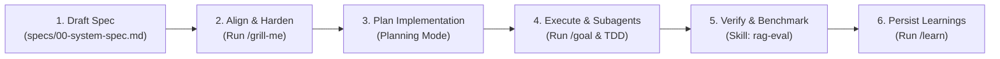

# Sales Assistant (Spec-Driven Development with Antigravity)

Welcome to the **Sales Assistant** project, a Retrieval-Augmented Generation (RAG) system designed from the ground up for **Spec-Driven Development (SDD)** with Google Antigravity.

---

## 🚀 Quick Start: Opening this Workspace

1. In the Antigravity IDE / Desktop interface, click **File > Open Folder...** (or launch from CLI).
2. Select:
   ```text
   /home/ngthuan/projects/sales-assistant
   ```
3. Once opened, Antigravity automatically detects:
   - **`AGENTS.md`**: Enforcing Spec-Driven rules and TDD protocols.
   - **`.agent/skills/rag-eval`**: Workspace skill for RAG evaluation.
   - **`specs/`**: The single source of truth for all requirements and architectures.

---

## 📐 The Spec-Driven Development (SDD) Lifecycle



### Stage 1: Specification (`specs/`)
- Every new feature or architectural pivot starts as a document in `specs/` using `specs/templates/spec-template.md`.
- No code is written in `src/` without an approved specification.
- See the baseline specification: [`specs/00-system-spec.md`](specs/00-system-spec.md).

### Stage 2: Spec Alignment with `/grill-me`
- **When to use**: Before writing code or approving a design.
- **Action**: Type `/grill-me` in the Antigravity chat with prompt:
  > *"Review `specs/00-system-spec.md` with me using `/grill-me` to stress-test chunking strategies and vector store choices."*
- **What happens**: Antigravity conducts a targeted interview asking sharp questions about edge cases, token limits, latency budgets, and trade-offs.

### Stage 3: Planning Mode (`implementation_plan.md`)
- After the spec is hardened, Antigravity creates an `implementation_plan.md` artifact.
- You review and approve the technical steps before any files are modified.

### Stage 4: Execution & Autonomous Tasks (`/goal`)
- For long-running or multi-file coding milestones, recommend using the `/goal` command:
  > *"Implement Phase 1 (Ingestion & Chunking) based on `specs/00-system-spec.md` /goal"*
- Antigravity will work autonomously across files, write tests in `tests/`, and verify every step.

### Stage 5: Verification & Benchmarking (Workspace Skill)
- The agent activates the `.agent/skills/rag-eval` skill to run precision benchmarks and verify hit-rates against acceptance criteria.
- Results are recorded in the `walkthrough.md` artifact.

### Stage 6: Knowledge Retention (`/learn`)
- When you refine a convention (e.g. prompt styling or specific chunking threshold), type `/learn` to store the guideline into your project rules permanently.

---

---

## 🚀 Running the API Server

Start the unified REST API gateway using the root entrypoint:

```bash
# 1. Run pre-flight health diagnostics (validates AWS Bedrock & OpenSearch connectivity)
python main.py --check

# 2. Start server in development mode (with auto-reload on http://127.0.0.1:8000)
python main.py

# 3. Start server in production mode with custom options
python main.py --host 0.0.0.0 --port 8000 --no-reload --workers 4
```

Interactive API documentation will be available at:
- **Swagger UI**: [http://127.0.0.1:8000/docs](http://127.0.0.1:8000/docs)
- **ReDoc**: [http://127.0.0.1:8000/redoc](http://127.0.0.1:8000/redoc)
- **Health Check**: [http://127.0.0.1:8000/health](http://127.0.0.1:8000/health)

---

## 🛠️ Project Structure

```text
sales-assistant/
├── main.py                      # Root CLI entrypoint & ASGI process manager
├── .agent/
│   └── skills/
│       └── rag-eval/            # Custom RAG evaluation skill & runbooks
├── specs/
│   ├── 00-system-spec.md        # Foundational baseline & Runtime Serving spec
│   └── templates/
│       └── spec-template.md     # Reusable spec template for new features
├── data/
│   └── raw/                     # Place raw documents (.txt, .md) here
├── src/                         # Modular codebase (built to match specs)
│   ├── api/                     # FastAPI REST layer & endpoints
│   ├── ingestion/               # Chunker & document parsers
│   ├── retrieval/               # Vector store & search mechanisms
│   └── generation/              # Prompt synthesis & LLM call
├── tests/                       # Spec-driven tests
├── AGENTS.md                    # Antigravity project rules
└── README.md                    # This guide
```

---

## 💬 Recommended Next Prompts to Try

1. **Conduct Spec Interview**:
   > *"Let's review `specs/00-system-spec.md`. Run `/grill-me` to stress-test our chunking and vector storage decisions."*
2. **Launch Implementation Milestone**:
   > *"The spec is approved. Create an implementation plan for building the ingestion and chunking module in `src/ingestion`."*
