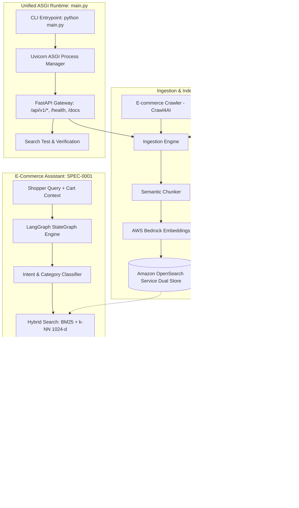
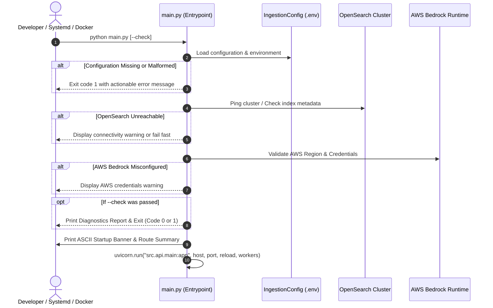

# SPEC-0000: Sales Assistant — Overall System Architecture Specification

**Spec ID**: `SPEC-0000`  
**Status**: `Approved`  
**Scope**: Overall System Architecture, Subsystem Boundaries, and Governance  
**Date**: 2026-09-18  

---

## 1. Executive Summary & Vision

The **Sales Assistant** is an enterprise-grade Retrieval-Augmented Generation (RAG) conversational agent engineered for e-commerce stores. The system enables natural-language customer inquiries regarding products, verified pricing, active promotions, and store policies (shipping, returns, warranties) while guaranteeing zero hallucinations through strict grounding and real-time inventory verification.

### 1.1 Core Business Goals
- **Verified Product Discovery**: Provide instant answers on product specs, live pricing, and stock status.
- **Deterministic Promotion Guidance**: Present valid coupon discounts, calculate maximum savings without stacking, and enforce minimum spend thresholds.
- **Grounded Policy Clarity**: Answer shipping, warranty, and return inquiries with direct links to official policies.
- **Merchant Integrity**: Politely refuse out-of-stock purchases or invalid coupons, redirecting shoppers to support when appropriate.

### 1.2 Non-Goals
- Direct in-chat credit card payment processing (assistant provides checkout CTAs).
- Arbitrary non-e-commerce general chit-chat (assistant redirects to store domain topics).
- Hardcoding domain data in prompt context (all knowledge must be grounded in OpenSearch or live hooks).

---

## 2. High-Level System Architecture



---

## 3. Subsystem Specification Hierarchy

The system strictly adheres to **Spec-Driven Development (SDD)**. Low-level technical contracts, Pydantic schemas, embedding dimensions, index mappings, and API endpoints are formally owned by their respective subsystem specifications:

| Spec ID | Subsystem | Specification File | Responsibilities |
| :--- | :--- | :--- | :--- |
| **`SPEC-0000`** | **Overall System & Server Runtime** | [`specs/00-system-spec.md`](specs/00-system-spec.md) | High-level topology, runtime CLI entrypoint (`main.py`), pre-flight diagnostics, subsystem boundaries, and cross-cutting SLAs. |
| **`SPEC-0001`** | **Assistant Orchestration** | [`specs/01-ecommerce-assistant-spec.md`](specs/01-ecommerce-assistant-spec.md) | LangGraph StateGraph, shopper context, promotion evaluation rules, live stock verification hooks, and UI citations. |
| **`SPEC-0002`** | **Ingestion & Indexing** | [`specs/02-ingestion-indexing-pipeline-spec.md`](specs/02-ingestion-indexing-pipeline-spec.md) | Crawl4AI crawling, markdown chunking, Bedrock Cohere v3 embeddings, OpenSearch k-NN lucene schema, Change Data Detection (CDC), and REST API. |
| **`SPEC-0003`** | **Retrieval & Re-ranking** | [`specs/03-hybrid-retrieval-reranking-spec.md`](specs/03-hybrid-retrieval-reranking-spec.md) *(Draft)* | Hybrid fusion (BM25 + Dense k-NN), cross-encoder re-ranking, and dynamic score thresholding. |

---

## 4. Cross-Cutting & Non-Functional Requirements

### 4.1 Cloud Infrastructure
- **Vector Storage**: Amazon OpenSearch Service domain equipped with native Lucene HNSW k-NN indexing and Vietnamese ASCII text analysis.
- **Foundation Models**: AWS Bedrock hosting `cohere.embed-multilingual-v3.0` (1024-d vectors) for dense representations and Claude / Nova for grounded synthesis.
- **Authentication**: AWS SigV4 by default with environment-driven fallback to Basic Auth for local testing.

### 4.2 Language & Tone Resilience
- **Vietnamese Diacritic Resiliency**: Hybrid search analyzers must handle shoppers typing with or without tone marks (e.g. `bep nuong` matching `bếp nướng`).
- **Brand & SKU Precision**: Exact lexical keywords (BM25) ensure high fidelity for technical part numbers, SKUs, and brand names.

### 4.3 Performance & Latency Budgets
- **Ingestion Run**: Change Data Detection (CDC) slashes recurring ingestion API calls by $\ge 90\%$.
- **Retrieval Latency**: OpenSearch hybrid point query $\le 100\text{ ms}$.
- **End-to-End Chat SLA**: Complete assistant response generation within $\le 2.0\text{ s}$.

---

## 5. Architectural Governance & SDD Workflow

1. **Spec as Single Source of Truth**: No feature code may be introduced in `src/` without referencing an approved spec document.
2. **Contract-First Implementation**: Data schemas, index mappings, and public interfaces must be agreed upon in the dedicated subsystem spec prior to implementation.
3. **Spec Updates on Pivot**: Any changes in requirements, data contracts, or architecture must be immediately reflected in the corresponding `specs/*.md` document.

---

## 6. Runtime Serving & Unified API Entrypoint Specification

### 6.1 Architectural Objective & Core Principles
The root entrypoint (`main.py`) serves as the single source of operational execution for the entire Sales Assistant system. It unifies server startup, pre-flight diagnostics, environment validation, and ASGI process supervision.

1. **Zero-Friction Developer Experience**: Executing `python main.py` must boot the entire REST gateway with sensible defaults without requiring lengthy command-line switches.
2. **Deterministic Pre-flight Verification**: Before opening network sockets, the entrypoint validates critical configuration (AWS region, credentials, OpenSearch connectivity) to prevent runtime failures deep inside request lifecycles.
3. **Operational Transparency (Banner DX)**: Displays an informative startup banner detailing API version, bound host/port, interactive docs links (`/docs`, `/redoc`), active vector indices, and registered route groups.
4. **Graceful Termination**: Captures `SIGINT` (Ctrl+C) and `SIGTERM` signals, completing in-flight transactions and closing client pools cleanly.

### 6.2 CLI Specification & Parameters

The entrypoint must provide an expressive command-line interface:

| Argument / Flag | Env Variable Fallback | Default Value | Description |
| :--- | :--- | :--- | :--- |
| `--host` | `APP_HOST` / `HOST` | `127.0.0.1` | Network interface address to bind server. |
| `--port` | `APP_PORT` / `PORT` | `8000` | TCP port to listen on. |
| `--reload` / `--no-reload` | `APP_RELOAD` | `True` in local dev | Enable/disable auto-reloading on code changes. |
| `--workers` | `APP_WORKERS` | `1` | Number of worker processes (enforced `1` if `--reload` is active). |
| `--log-level` | `APP_LOG_LEVEL` | `info` | Logging verbosity (`debug`, `info`, `warning`, `error`). |
| `--check` | — | `False` | Run pre-flight health diagnostics only and exit without launching HTTP listener. |

### 6.3 Pre-flight Diagnostics Protocol

When launched (or when invoked with `--check`), the startup protocol executes the following validation pipeline:



### 6.4 Terminal Banner & Route Discovery Contract

Upon successful initialization, `main.py` prints a clean diagnostic overview:

```text
================================================================================
  🛍️  SALES ASSISTANT — API GATEWAY & RAG RUNTIME
================================================================================
  Status:           Online (Ready for requests)
  API Version:      v0.1.0
  Listening Address: http://127.0.0.1:8000
  Swagger UI:       http://127.0.0.1:8000/docs
  ReDoc:            http://127.0.0.1:8000/redoc
  OpenSearch Host:  localhost:9200 (Index: sales-assistant-catalog)
  Bedrock Model:    cohere.embed-multilingual-v3.0 (1024-d)
  Active Routes:
    - [GET]  /health
    - [POST] /api/v1/crawler/crawl
    - [POST] /api/v1/ingestion/run
    - [POST] /api/v1/ingestion/index-raw
    - [POST] /api/v1/ingestion/search
================================================================================
```

### 6.5 Verification & Acceptance Criteria
- **AC-1 (Help Flag)**: `python main.py --help` outputs standard argument flags and exits with code `0`.
- **AC-2 (Dry-Run Diagnostics)**: `python main.py --check` evaluates environment, OpenSearch client, and Bedrock embedder initialization, reporting exact status.
- **AC-3 (Live Boot)**: Executing `python main.py` starts the server on specified port, logs the startup banner, and successfully handles `GET /health` responding `{"success": true}` with HTTP 200.
- **AC-4 (Signal Handling)**: Sending `SIGINT` (Ctrl+C) gracefully halts Uvicorn without traceback leaks.
