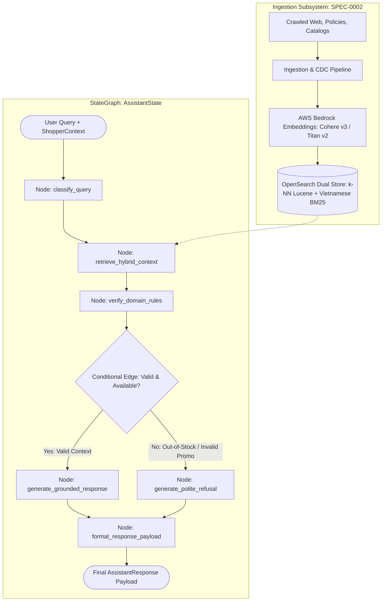

# SPEC-0001: Sales Assistant — E-Commerce Customer Assistant Specification

**Spec ID**: `SPEC-0001`  
**Status**: `Approved / Aligned via /grill-me`  
**Author**: Engineering Team  
**Date**: 2026-09-14  
**Parent Spec**: [`specs/00-system-spec.md`](specs/00-system-spec.md)  
**Cloud Infrastructure**: Fully Cloud-Dependent AWS Architecture (Amazon OpenSearch Service + AWS Bedrock)

---

## 1. Problem Statement & Motivation

Online shoppers frequently require instantaneous, accurate guidance regarding product specifications, current promotions, and store policies (shipping, returns, and warranties). In standard generative chatbots, general-purpose LLMs often hallucinate expired coupons, misquote prices, or claim that out-of-stock items are available, leading to shopper frustration, elevated checkout abandonment, and support ticket escalations.

This specification details the architecture for an **E-Commerce Customer Assistant** built atop our modular RAG pipeline. The system runs on a **fully cloud-dependent AWS architecture**, utilizing **Amazon OpenSearch Service** as its vector database and **AWS Bedrock** for embeddings and LLM synthesis. The assistant is constrained by rigorous domain logic:
1. It ingests multi-source data (crawled HTML, Markdown policies, CSV catalogs, JSON promo feeds) classified into standardized category chunks (`product`, `promotion`, `policy`) via the pipeline specified in [`specs/02-ingestion-indexing-pipeline-spec.md`](specs/02-ingestion-indexing-pipeline-spec.md).
2. It uses a **hybrid real-time inventory hook** to verify live stock and pricing for candidate products retrieved from OpenSearch.
3. It deterministically verifies promo validity (temporal UTC windows, cart minimum spend, SKU exclusions), presenting all eligible discounts, highlighting maximum savings, and noting that coupons cannot be combined at checkout.
4. It enforces a strict **polite refusal and support redirect policy** when items are out of stock or coupon codes do not exist.
5. It returns a **hybrid response payload** consisting of natural Markdown chat text and structured typed citations for frontend UI cards.

### 1.1 User Stories
- **Shopper Product Discovery**: As a shopper, I want to query product specifications, verified live prices, and stock availability so that I can make purchase decisions with confidence.
- **Shopper Promotion Inquiry**: As a shopper, I want to discover all active promotions that apply to my cart, understand which code maximizes my savings, and know that promo codes cannot be stacked at checkout.
- **Shopper Policy Clarity**: As a shopper, I want exact answers regarding returns, shipping windows, and warranties with direct links to official store policies.
- **Merchant & Support Integrity**: As an e-commerce merchant, I want the assistant to refuse invalid discount claims and out-of-stock purchases politely, redirecting shoppers to customer support links when issues arise.

### 1.2 Non-Goals / Out of Scope
- Direct in-chat credit card payment processing (assistant provides product card checkout CTAs).
- Customer account authentication and order tracking history lookup (deferred to `SPEC-0004: Customer Account & Order Tracking Integration`).
- Dynamic price bidding or personal coupon generation.

---

## 2. Technical Architecture & Data Contracts

### 2.1 System Architecture & LangGraph Workflow

The assistant pipeline is implemented using **LangChain** (`langchain-aws`, `langchain-community`, `langchain-core`) and orchestrated as a stateful **LangGraph** `StateGraph`:



### 2.2 Data Models & Schemas

#### 2.2.1 Knowledge Grounding Contracts (External)
The assistant retrieves and grounds responses upon `EcomChunk` instances categorized as `product`, `promotion`, or `policy`. The underlying schemas (`EcomChunk`, `ProductMetadata`, `PromotionMetadata`, `PolicyMetadata`) and OpenSearch index mappings are authoritatively defined in [`specs/02-ingestion-indexing-pipeline-spec.md#L25-L116`](specs/02-ingestion-indexing-pipeline-spec.md#L25-L116).

#### 2.2.2 Assistant Runtime Contracts
The assistant defines specialized dataclasses for conversational state, cart context, structured citations, and UI response cards:

```python
from dataclasses import dataclass, field
from datetime import datetime
from typing import Any, Literal, Optional, TypedDict

from src.ingestion.models import CategoryType, EcomChunk, PromotionMetadata, StockStatus

@dataclass
class CartItem:
    sku: str
    product_id: str
    price: float
    quantity: int

@dataclass
class ShopperContext:
    cart_items: list[CartItem] = field(default_factory=list)
    cart_subtotal: float = 0.0
    current_time: datetime = field(default_factory=datetime.utcnow)

@dataclass
class Citation:
    citation_type: Literal["product_cta", "policy_link", "promo_terms", "support_redirect"]
    title: str
    url: str
    price_display: Optional[str] = None
    stock_status: Optional[StockStatus] = None
    promo_code: Optional[str] = None
    estimated_savings: Optional[float] = None
    metadata: dict[str, Any] = field(default_factory=dict)

@dataclass
class AssistantResponse:
    query: str
    answer: str  # Natural Markdown text for chat display
    citations: list[Citation]  # Structured typed objects for UI cards & CTAs
    refusal_triggered: bool = False
    refusal_reason: Optional[str] = None
    support_redirect_url: Optional[str] = None
    retrieved_chunks: list[EcomChunk] = field(default_factory=list)
    latency_ms: float = 0.0

class AssistantState(TypedDict, total=False):
    """State schema passed across LangGraph nodes."""
    query: str
    shopper_context: ShopperContext
    intent_category: Optional[CategoryType]
    retrieved_chunks: list[EcomChunk]
    validated_chunks: list[EcomChunk]
    evaluated_promotions: list[tuple[PromotionMetadata, bool, str, float]]
    refusal_triggered: bool
    refusal_reason: Optional[str]
    support_redirect_url: Optional[str]
    answer: str
    citations: list[Citation]
    response: AssistantResponse
```

### 2.3 Knowledge Store & Hybrid Retrieval Integration

The assistant interfaces directly with Amazon OpenSearch Service:
- **Vector Storage**: Amazon OpenSearch Service domain hosting normalized 1024-dimensional vectors in a native Lucene HNSW k-NN index, equipped with Vietnamese ASCII text analyzers as defined in [`specs/02-ingestion-indexing-pipeline-spec.md#L186-L262`](specs/02-ingestion-indexing-pipeline-spec.md#L186-L262).
- **Hybrid Retrieval**: Combines BM25 lexical keyword matching (for exact brand names, SKUs, and unaccented terms) with dense vector k-NN search for semantic concept matching.
- **Change Data Detection (CDC)**: Guarantees that catalog changes, price updates, and orphan sweeps executed by the ingestion pipeline are immediately reflected in assistant retrieval without requiring manual cache invalidation.

---

## 3. E-Commerce Domain Logic & Rules

### 3.1 Hybrid Live Stock & Pricing Synchronization
Semantic retrieval identifies top-$K$ candidate products from OpenSearch. Before context synthesis:
1. Candidate product IDs/SKUs are dispatched to a `LiveInventoryService` hook.
2. The hook returns current stock status (`in_stock`, `out_of_stock`, `backorder`) and verified live price.
3. If an item is `out_of_stock`, the chunk metadata is updated, preventing the assistant from guaranteeing immediate availability.

### 3.2 Promotion Stacking & Evaluation Rules
1. **Temporal UTC Validation**:
   $$\text{promo.start\_date} \le \text{context.current\_time} \le \text{promo.end\_date}$$
   Expired or future promotions are pruned from active recommendations.
2. **Spend & Exclusion Constraints**:
   $$\text{context.cart\_subtotal} \ge \text{promo.min\_spend} \quad \text{and} \quad \forall \text{item} \in \text{cart}, \text{item.sku} \notin \text{promo.excluded\_skus}$$
3. **Presentation & No-Stacking Policy**:
   - The assistant lists **all valid eligible promotions** for the shopper's cart.
   - It calculates the prospective discount for each code and **highlights the single code yielding the greatest savings**.
   - It explicitly includes the disclaimer: *"Please note that promotional codes cannot be combined or stacked at checkout."*

### 3.3 Polite Refusal & Support Redirect Policy
When out-of-stock items, non-existent promo codes, or unresolvable policy issues are encountered:
1. **Out-of-Stock Products**:
   The assistant politely states that the requested item is out of stock. It does not hallucinate alternative order methods, and it provides a direct **Customer Support / Live Agent link**:
   > *"<Product Name> is currently out of stock. You can reach out to our [Customer Support](https://store.example.com/support) team to inquire about restock timelines or order assistance."*
2. **Non-Existent or Invalid Coupons**:
   The assistant politely clarifies that the requested discount does not exist:
   > *"I cannot verify coupon code '[CODE]'. If you need assistance with promotions, please contact our [Customer Support](https://store.example.com/support) team or explore our current active promotions below."*
   A typed citation with `citation_type: "support_redirect"` is included in the payload.

### 3.4 Hybrid Response Payload Specification
Every response consists of:
- `answer`: Rich Markdown text for the conversational stream.
- `citations`: Typed list containing:
  - `product_cta`: `title`, `price_display`, `url`, `stock_status`
  - `policy_link`: `title`, `url`
  - `promo_terms`: `title`, `promo_code`, `estimated_savings`, `terms_url`
  - `support_redirect`: `title`, `url` (`https://store.example.com/support`)

---

## 4. Interfaces & API Contracts

```python
from abc import ABC, abstractmethod
from pathlib import Path
from typing import Any, Literal, Optional
from langgraph.graph import StateGraph, START, END
from langgraph.graph.state import CompiledStateGraph
from langchain_aws import ChatBedrockConverse
from langchain_community.vectorstores import OpenSearchVectorSearch

class BaseIngestionParser(ABC):
    """Parses raw files using AWS Bedrock LLM classification into typed chunks."""
    @abstractmethod
    def parse_and_classify(self, file_path: Path) -> list[EcomChunk]:
        pass

class LiveInventoryService(ABC):
    """Real-time inventory and pricing verification hook."""
    @abstractmethod
    def get_live_status(self, skus: list[str]) -> dict[str, dict[str, Any]]:
        """Returns {sku: {"price": float, "stock_status": StockStatus}}."""
        pass

class PromotionsValidator:
    """Deterministic validation of promotional validity and savings calculation."""
    @staticmethod
    def evaluate_promotions(
        promos: list[PromotionMetadata],
        context: ShopperContext
    ) -> list[tuple[PromotionMetadata, bool, str, float]]:
        """Returns list of (promo, is_valid, reason, estimated_savings)."""
        pass

class OpenSearchRetriever(ABC):
    """Retrieves context chunks from Amazon OpenSearch Service with k-NN vector search."""
    @abstractmethod
    def retrieve(
        self,
        query: str,
        category: Optional[CategoryType] = None,
        top_k: int = 5
    ) -> list[EcomChunk]:
        pass

class AssistantGraphBuilder:
    """Builds and compiles the LangGraph StateGraph for the E-Commerce Assistant."""
    def __init__(
        self,
        vectorstore: OpenSearchVectorSearch,
        inventory_service: LiveInventoryService,
        validator: PromotionsValidator,
        llm: ChatBedrockConverse
    ):
        self.vectorstore = vectorstore
        self.inventory_service = inventory_service
        self.validator = validator
        self.llm = llm

    def classify_query_node(self, state: AssistantState) -> dict[str, Any]:
        """Classifies shopper query intent into category (product, promotion, policy, general)."""
        pass

    def retrieve_hybrid_context_node(self, state: AssistantState) -> dict[str, Any]:
        """Executes OpenSearch hybrid retrieval (dense k-NN + BM25) filtered by category."""
        pass

    def verify_domain_rules_node(self, state: AssistantState) -> dict[str, Any]:
        """Executes live stock check and deterministic promotion spend/date evaluation."""
        pass

    def route_synthesis_condition(self, state: AssistantState) -> Literal["generate_grounded", "generate_refusal"]:
        """Conditional routing: routes to refusal if out of stock or coupon invalid; else grounded synthesis."""
        pass

    def generate_grounded_response_node(self, state: AssistantState) -> dict[str, Any]:
        """Synthesizes verified e-commerce response using Bedrock Claude 3.5 Sonnet / Nova."""
        pass

    def generate_polite_refusal_node(self, state: AssistantState) -> dict[str, Any]:
        """Generates polite refusal with customer support link and clear reason."""
        pass

    def format_response_payload_node(self, state: AssistantState) -> dict[str, Any]:
        """Assembles the final AssistantResponse with structured citations and latency."""
        pass

    def compile(self) -> CompiledStateGraph:
        """Constructs and compiles the LangGraph state machine."""
        workflow = StateGraph(AssistantState)
        workflow.add_node("classify_query", self.classify_query_node)
        workflow.add_node("retrieve_hybrid_context", self.retrieve_hybrid_context_node)
        workflow.add_node("verify_domain_rules", self.verify_domain_rules_node)
        workflow.add_node("generate_grounded_response", self.generate_grounded_response_node)
        workflow.add_node("generate_polite_refusal", self.generate_polite_refusal_node)
        workflow.add_node("format_response_payload", self.format_response_payload_node)

        workflow.add_edge(START, "classify_query")
        workflow.add_edge("classify_query", "retrieve_hybrid_context")
        workflow.add_edge("retrieve_hybrid_context", "verify_domain_rules")
        workflow.add_conditional_edges(
            "verify_domain_rules",
            self.route_synthesis_condition,
            {
                "generate_grounded": "generate_grounded_response",
                "generate_refusal": "generate_polite_refusal"
            }
        )
        workflow.add_edge("generate_grounded_response", "format_response_payload")
        workflow.add_edge("generate_polite_refusal", "format_response_payload")
        workflow.add_edge("format_response_payload", END)

        return workflow.compile()

class EcomCustomerAssistant:
    """Primary assistant entrypoint orchestrating the compiled LangGraph workflow."""
    def __init__(self, graph: CompiledStateGraph):
        self.graph = graph

    def answer_query(
        self,
        query: str,
        context: Optional[ShopperContext] = None
    ) -> AssistantResponse:
        """Invokes the compiled LangGraph state machine and returns the AssistantResponse."""
        initial_state: AssistantState = {
            "query": query,
            "shopper_context": context or ShopperContext(),
            "retrieved_chunks": [],
            "validated_chunks": [],
            "evaluated_promotions": [],
            "refusal_triggered": False,
            "citations": []
        }
        final_state = self.graph.invoke(initial_state)
        return final_state["response"]
```

---

## 5. Acceptance Criteria & Evaluation Plan

### 5.1 Automated Test Suite (`tests/`)
To enable zero-cost, deterministic, and fast offline CI runs, the unit test suite utilizes mocked AWS adapters (`unittest.mock` and `botocore.stub.Stubber`):
- [ ] `tests/test_ingestion_bedrock.py`:
  - Verify mocked Bedrock classification tags `category: "product"`, `"promotion"`, `"policy"`.
  - Verify metadata extraction accurately parses CSV catalog fields, JSON promo dates, and Markdown policies.
- [ ] `tests/test_inventory_hook.py`:
  - Verify live inventory hook overrides static chunk stock status when item is out of stock.
  - Verify live price updates are reflected in candidate context.
- [ ] `tests/test_promotions_logic.py`:
  - Verify expired and future promo rejection.
  - Verify minimum spend enforcement against cart subtotal.
  - Verify promotion ranking highlighting maximum savings and asserting no-stacking disclaimer.
- [ ] `tests/test_refusal_redirect.py`:
  - Assert out-of-stock product inquiries generate polite refusals and include `support_redirect` citations.
  - Assert invalid promo inquiries generate polite clarifications and include support redirect URLs.
- [ ] `tests/test_opensearch_adapter.py`:
  - Verify k-NN query construction and category filter mapping against OpenSearch client stub.
- [ ] `tests/test_assistant_graph.py`:
  - Verify LangGraph `AssistantGraphBuilder` node transitions and state propagation.
  - Verify conditional edge routing to `generate_polite_refusal` on out-of-stock or invalid promo codes.
  - Verify end-to-end `EcomCustomerAssistant.answer_query` execution with mocked nodes.

### 5.2 RAG Benchmarking (`.agent/skills/rag-eval`)
Live AWS integration tests can be enabled via `RUN_LIVE_AWS_TESTS=true`:
- **Promo Precision Benchmark**: **$100\%$ precision** across 50 temporal/cart benchmark scenarios.
- **Product Retrieval Hit Rate @ 3**: $\ge 90\%$ in OpenSearch k-NN index.
- **Faithfulness / Groundedness**: $1.0$ (Zero hallucinated pricing, discount percentages, or ungrounded policies).
- **Latency Budget**: End-to-end response time $\le 1200\text{ ms}$.

---

## 6. Grill-Me Alignment Log

During the `/grill-me` review session on 2026-09-14, the following architectural decisions were aligned:
1. **Cloud Architecture & Vector Store**: Amazon OpenSearch Service was selected as the vector database, committing the project to a fully cloud-dependent AWS architecture.
2. **Embeddings & LLM**: AWS Bedrock was selected (`amazon.titan-embed-text-v2:0` for embeddings, `anthropic.claude-3-5-sonnet-20240620-v1:0` / `amazon.nova` for classification and synthesis).
3. **Ingestion Classification**: Bedrock LLM-assisted classification selected for parsing multi-source documents and extracting metadata.
4. **Stock & Pricing Freshness**: Hybrid architecture selected—semantic candidate retrieval from OpenSearch followed by a real-time `LiveInventoryService` lookup hook.
5. **Promotion Evaluation**: Present all eligible promo codes, highlight the one with maximum savings, and explicitly declare that coupons cannot be combined at checkout.
6. **Refusal Recovery**: Polite clarification paired with direct customer support redirection links.
7. **Response Payload**: Hybrid format consisting of Markdown text for chat display and structured `citations` objects for frontend UI cards.
8. **Testing Strategy**: Mocked AWS adapters (`botocore` Stubber / `unittest.mock`) for offline CI, with live AWS integration tests enabled via `RUN_LIVE_AWS_TESTS=true`.
9. **Orchestration Framework**: Adopted **LangChain** (`langchain-aws`, `langchain-community`, `langchain-core`) for standardized AWS component abstractions, and **LangGraph** (`StateGraph`) for deterministic, stateful multi-step agentic workflow execution.

