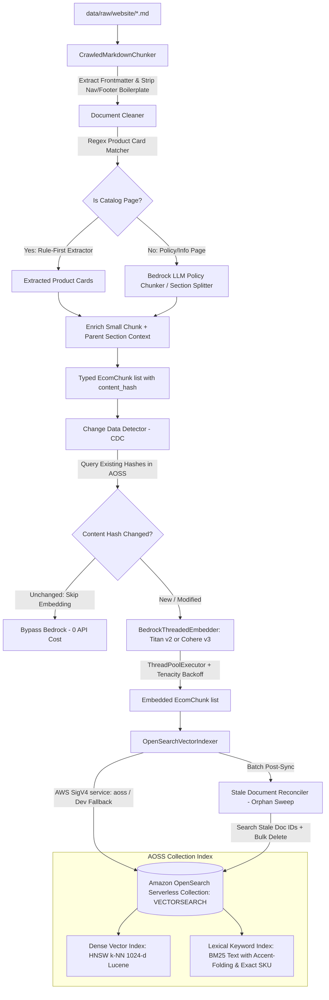

# Ingestion & OpenSearch Serverless Vector Indexing Pipeline Specification

**Spec ID**: `SPEC-0002`  
**Status**: `Approved`  
**Author**: Antigravity & User  
**Date**: 2026-09-18 (Updated from OpenSearch Domain to OpenSearch Serverless)  
**Parent Spec**: [`specs/01-ecommerce-assistant-spec.md`](file:///home/ngthuan/projects/sales-assistant/specs/01-ecommerce-assistant-spec.md)

---

## 1. Problem Statement & Motivation

- **Context**: The Sales Assistant project crawls raw e-commerce web pages (such as `bepbbq.com`) into Markdown files with YAML frontmatter via `Crawl4AI` (`src/ingestion/crawler.py`). However, raw crawled pages contain substantial web boilerplate (menus, sidebars, navigation bars, cart links) alongside actual product cards, promotions, and return/warranty policies. Before vector retrieval can function, we need a robust, automated pipeline to ingest raw crawled Markdown, clean and chunk the semantic content, classify chunks into standardized domain categories (`product`, `promotion`, `policy`), generate dense vector embeddings via AWS Bedrock, and bulk-index them into an **Amazon OpenSearch Serverless (AOSS)** collection (`VECTORSEARCH` type). Switching from a provisioned OpenSearch domain to OpenSearch Serverless eliminates the operational overhead of cluster provisioning, master/data node sizing, and manual shard/replica management, providing elastic compute scaling (OCUs) and pay-per-use efficiency.
- **User Story**: As a backend developer and test engineer, I want both a modular Python module API (`crawled data -> chunking -> embedding -> OpenSearch Serverless bulk index`) and a comprehensive, modular REST API (`src/api/v1/endpoints/ingestion.py` and `crawler.py`) equipped with Change Data Detection (CDC), serverless-compatible stale document reconciliation (via search + bulk delete), Vietnamese text analysis, and dual lexical/vector indexing, so that I can programmatically trigger fast, cost-efficient data ingestion, interact with the backend, and self-test each stage (crawling, chunk inspection, embedding, indexing, CDC, and search) quickly via OpenAPI/Swagger UI.
- **Non-Goals / Out of Scope**:
  - Provisioning or managing self-hosted/dedicated OpenSearch cluster nodes, shards, or master instances (fully handled by AWS OpenSearch Serverless).
  - Online conversational agent / multi-turn chat generation (governed by `specs/01-ecommerce-assistant-spec.md`).
  - Production frontend UI / consumer web application (this spec focuses on BE module APIs and developer self-test REST endpoints).
  - Real-time stock verification hook at query time (handled downstream by `LiveInventoryService`).

---

## 2. Technical Architecture & Data Contracts

### 2.1 Data Models & Schemas

Reusing and enhancing the contracts established in [`specs/01-ecommerce-assistant-spec.md`](file:///home/ngthuan/projects/sales-assistant/specs/01-ecommerce-assistant-spec.md#L74-L135):

```python
from dataclasses import dataclass, field
from datetime import datetime
from typing import Any, Literal, Optional

CategoryType = Literal["product", "promotion", "policy"]
StockStatus = Literal["in_stock", "out_of_stock", "backorder"]

@dataclass
class ProductMetadata:
    product_id: str
    name: str
    price: float
    currency: str = "VND"
    stock_status: StockStatus = "in_stock"
    product_url: str = ""
    sku: Optional[str] = None
    categories: list[str] = field(default_factory=list)
    attributes: dict[str, Any] = field(default_factory=dict)

@dataclass
class PromotionMetadata:
    promo_code: str
    discount_type: Literal["percentage", "fixed_amount", "free_shipping"]
    discount_value: float
    start_date: datetime
    end_date: datetime
    min_spend: float = 0.0
    excluded_skus: list[str] = field(default_factory=list)
    applicable_categories: list[str] = field(default_factory=list)
    terms_url: Optional[str] = None
    stackable: bool = False

@dataclass
class PolicyMetadata:
    policy_type: Literal["shipping", "returns", "warranty", "privacy", "terms"]
    section_title: str
    effective_date: datetime
    policy_url: str
    parent_section_content: Optional[str] = None  # Parent-child small-to-big context expansion

@dataclass
class EcomChunkMetadata:
    category: CategoryType
    source_file: str
    source_type: Literal["crawler", "markdown", "csv", "json"] = "crawler"
    source_url: str = ""
    page_title: str = ""
    crawl_timestamp: Optional[datetime] = None  # Crawl time used for stale document reconciliation
    product: Optional[ProductMetadata] = None
    promotion: Optional[PromotionMetadata] = None
    policy: Optional[PolicyMetadata] = None

@dataclass
class EcomChunk:
    id: str  # Deterministic hash: sha256(source_url + chunk_index)
    doc_id: str
    chunk_index: int
    content: str  # Formatted text used for vector embedding and BM25 lexical search
    content_hash: str  # sha256 of raw chunk content for Change Data Detection (CDC)
    metadata: EcomChunkMetadata
    embedding: Optional[list[float]] = None

    def to_langchain_document(self) -> Any:
        """Converts EcomChunk to a standard langchain_core.documents.Document."""
        from langchain_core.documents import Document
        return Document(
            page_content=self.content,
            metadata={
                "id": self.id,
                "doc_id": self.doc_id,
                "chunk_index": self.chunk_index,
                "content_hash": self.content_hash,
                "category": self.metadata.category,
                "source_file": self.metadata.source_file,
                "source_url": self.metadata.source_url,
                "crawl_timestamp": self.metadata.crawl_timestamp.isoformat() if self.metadata.crawl_timestamp else None,
                "product_id": self.metadata.product.product_id if self.metadata.product else None,
                "product_name": self.metadata.product.name if self.metadata.product else None,
                "price": self.metadata.product.price if self.metadata.product else None,
                "currency": self.metadata.product.currency if self.metadata.product else None,
                "stock_status": self.metadata.product.stock_status if self.metadata.product else None,
                "policy_type": self.metadata.policy.policy_type if self.metadata.policy else None,
                "parent_section_content": self.metadata.policy.parent_section_content if self.metadata.policy else None,
                "promo_code": self.metadata.promotion.promo_code if self.metadata.promotion else None,
            }
        )
```

---

### 2.2 Component Interactions



---

### 2.3 Algorithms & Parameters

1. **Boilerplate Stripping & Cleaning**:
   - Parse YAML frontmatter (`url`, `title`, `crawl_timestamp`, `content_hash`).
   - Strip navigation bars (e.g. `[Skip to content]`, top menus, cart counters, brand listings) and recurring footers (`VỀ CHÚNG TÔI`, `THÔNG TIN`, social links, hotline blocks).
2. **Chunking & Parsing Strategy (Dual Hybrid Approach)**:
   - **Product Listings (Multi-Card Rule-First)**:
     - Match product card markdown blocks containing image links, product names, URLs, prices (e.g., `36.850.000 ₫`), and stock indicators (`Hết hàng` -> `out_of_stock`, or `add-to-cart` / price present -> `in_stock`).
     - Product ID is derived from URL slug or add-to-cart query parameter. Each card forms a discrete `EcomChunk`.
   - **Product Detail Pages (Comprehensive Single-Item Parser)**:
     - Detects dedicated product detail pages (single primary title, detailed specification tables, dimensions, technical parameters, warranty blocks).
     - Extracts structured technical specs, materials, and warranty information into `metadata.product.attributes`, embedding the full product synopsis as a single high-fidelity chunk.
   - **Policy Pages / Unstructured Text (Bedrock Fallback)**:
     - Invoked for informational/policy markdown when rule patterns do not detect catalog cards or product detail sheets.
     - Splits by markdown header sections (`#`, `##`, `###`) with target size 300–600 tokens and 50-token overlap.
3. **Enriched Semantic Content Template for Embeddings**:
   - Product chunk embedding content is structured as:
     ```text
     Tên sản phẩm: {name} | Danh mục: {breadcrumb_or_title} | Giá: {price:,.0f} VND | Tình trạng: {stock_status} | Link: {product_url}
     ```
   - Policy chunk embedding content is structured as:
     ```text
     Chính sách: {policy_type} | Tiêu đề: {section_title} | Nội dung: {section_text}
     ```
4. **Parent-Child / Small-to-Big Retrieval for Policies**:
   - For `policy` chunks, a concise, highly focused sub-paragraph (300 tokens) is embedded in `embedding` for high retrieval precision.
   - The full surrounding section text is stored in `metadata.policy.parent_section_content`. When retrieved by downstream generation, the LLM receives the full authoritative policy context without truncation.
5. **Change Data Detection (CDC) & Stale Document Reconciliation (Orphan Sweeps)**:
   - Each chunk computes `content_hash = sha256(content.encode()).hexdigest()`.
   - **CDC Query Pattern**: Before requesting Bedrock embeddings, the pipeline queries OpenSearch via **Batch `_mget` by document ID** (`_source: ["content_hash", "doc_id"]`) in batches of up to 500 IDs. This provides deterministic, point-lookup latency without query scoring overhead.
   - If an existing indexed document has an identical `content_hash`, embedding generation and indexing are skipped. This eliminates redundant AWS Bedrock API charges and slashes recurring ingestion runtimes by up to 95%.
   - **Stale Document Reconciliation (Explicit Orphan Sweep - AOSS Safe)**: To prevent accidental deletions during partial crawl runs or network timeouts, orphan reconciliation operates via **explicit manual invocation** (`pipeline.reconcile_orphans(...)` or CLI flag `--purge-orphans`). Because OpenSearch Serverless (AOSS) **does not support the `_delete_by_query` API**, reconciliation executes a serverless-safe two-stage orphan purge:
      1. Dispatches an OpenSearch `search` query with `_source: false` to retrieve `_id` values under the target domain/source prefix whose IDs are absent from `active_doc_ids`.
      2. Dispatches bulk deletions using `opensearchpy.helpers.bulk` with `{"_op_type": "delete", "_index": index_name, "_id": doc_id}`. This provides 100% compatibility across both OpenSearch Serverless collections and provisioned clusters without invoking unsupported APIs.
6. **Bedrock Embedding Concurrency, Resilience & Multilingual Models**:
    - **Active Default Model**: `cohere.embed-multilingual-v3.0` (1024-dimensional normalized vectors; native state-of-the-art representation for Vietnamese compound terms; uses `input_type="search_document"` for indexing and `input_type="search_query"` for retrieval).
    - **Configurable Alternative**: `amazon.titan-embed-text-v2:0` (1024-dimensional normalized vectors, general purpose cost-effective alternative).
    - **Concurrency**: `ThreadPoolExecutor` with 5–8 concurrent worker threads.
    - **Resilience**: `tenacity` exponential backoff with jitter on `botocore.exceptions.ClientError` with error code `ThrottlingException` or `RequestLimitExceeded`.
7. **Hybrid-Ready OpenSearch Serverless Index Schema (BM25 + Dense k-NN + Vietnamese Analysis)**:
    - **OpenSearch Serverless Collection Type**:
      - Must use collection type **`VECTORSEARCH`**. The alternative `SEARCH` collection type does NOT support `knn_vector` indexes.
      - AOSS automatically manages index sharding, partition scaling, and compute via OpenSearch Compute Units (OCUs).
      - **Index Settings Restrictions**: Setting `index.number_of_shards` or `index.number_of_replicas` is **strictly prohibited and rejected** by OpenSearch Serverless. The index settings payload must only define `index.knn: true` and custom analyzers.
    - **AOSS Security Policy Prerequisites**:
      Before creating indexes or inserting documents, an AOSS collection requires three decoupled AWS policies:
      1. *Encryption Policy*: KMS key or AWS-owned key defining collection encryption.
      2. *Network Policy*: Controls VPC or public Internet endpoint access to the collection.
      3. *Data Access Policy*: Explicitly grants IAM principals permissions for data and index operations (`aoss:CreateCollectionItems`, `aoss:DeleteCollectionItems`, `aoss:UpdateCollectionItems`, `aoss:DescribeCollectionItems`, `aoss:CreateIndex`, `aoss:DeleteIndex`, `aoss:UpdateIndex`, `aoss:DescribeIndex`).
    - **Dual Search Architecture**:
      - `embedding` (`knn_vector`, 1024-d, `lucene` HNSW cosine): native OpenSearch 2.x engine supporting efficient metadata pre-filtering and memory efficiency.
      - `content` (`text` with multi-field `folded`): standard tokenizer plus `vietnamese_ascii_analyzer` (lowercase + `asciifolding`) to match shopper queries typed without tone marks (e.g. `bep nuong` matching `bếp nướng`).
      - `metadata.product_id` and `metadata.sku` (`keyword`): enables exact-match lexical lookups.
    - **AWS SigV4 Authentication for AOSS**:
      - AWS SigV4 signing service **must be `"aoss"`** (using `"es"` produces HTTP 403 Forbidden on AOSS endpoints).
      - Uses `opensearchpy.AWSV4SignerAuth(credentials, region, service="aoss")` with `RequestsHttpConnection`.
      - Connection URL targets HTTPS port 443 (e.g. `https://<collection-id>.<region>.aoss.amazonaws.com:443`).
      - Supports config-driven fallback to Basic Auth (`OPENSEARCH_USERNAME` / `OPENSEARCH_PASSWORD`) or no-auth when `OPENSEARCH_USE_AWS_AUTH=false` for local Docker or CI test environments.
    - **LangChain Integration**:
      - `OpenSearchVectorSearch` instance initialized with `is_aoss=True` to adapt query formulation and bypass unsupported cluster-level APIs.
    - **Index Settings & k-NN Mapping Payload**:
      ```json
      {
        "settings": {
          "index": {
            "knn": true,
            "knn.algo_param.ef_search": 100
          },
          "analysis": {
            "analyzer": {
              "vietnamese_ascii_analyzer": {
                "tokenizer": "standard",
                "filter": ["lowercase", "asciifolding"]
              }
            }
          }
        },
        "mappings": {
          "properties": {
            "doc_id": { "type": "keyword" },
            "chunk_id": { "type": "keyword" },
            "content_hash": { "type": "keyword" },
            "category": { "type": "keyword" },
            "content": {
              "type": "text",
              "fields": {
                "folded": {
                  "type": "text",
                  "analyzer": "vietnamese_ascii_analyzer"
                }
              }
            },
            "embedding": {
              "type": "knn_vector",
              "dimension": 1024,
              "method": {
                "name": "hnsw",
                "space_type": "cosinesimil",
                "engine": "lucene"
              }
            },
            "metadata": {
              "type": "object",
              "properties": {
                "source_url": { "type": "keyword" },
                "source_file": { "type": "keyword" },
                "crawl_timestamp": { "type": "date" },
                "product_id": { "type": "keyword" },
                "product_name": {
                  "type": "text",
                  "fields": {
                    "folded": {
                      "type": "text",
                      "analyzer": "vietnamese_ascii_analyzer"
                    }
                  }
                },
                "price": { "type": "double" },
                "currency": { "type": "keyword" },
                "stock_status": { "type": "keyword" },
                "policy_type": { "type": "keyword" },
                "parent_section_content": { "type": "text", "index": false },
                "promo_code": { "type": "keyword" }
              }
            }
          }
        }
      }
      ```

### 2.4 Environment Variables & Dynamic Configuration

All dynamic variables, AWS credentials, embedding parameters, and OpenSearch Serverless connection settings must be loaded from an environment file (`.env` with template in `.env.example`) or the process environment. Hardcoding credentials, model IDs, or dimensions in source code is strictly prohibited.

| Variable Name | Type | Default Value | Description |
| :--- | :--- | :--- | :--- |
| `BEDROCK_EMBEDDING_MODEL_ID` | `str` | `cohere.embed-multilingual-v3.0` | AWS Bedrock embedding model ID (`cohere.embed-multilingual-v3.0` or `amazon.titan-embed-text-v2:0`) |
| `BEDROCK_EMBEDDING_DIMENSION` | `int` | `1024` | Vector dimensionality (must match Bedrock model and OpenSearch index mapping) |
| `BEDROCK_MAX_WORKERS` | `int` | `5` | Concurrency thread pool size for Bedrock embedding requests |
| `AWS_REGION` | `str` | `us-east-1` | AWS Region for Bedrock and SigV4 OpenSearch authentication |
| `AWS_ACCESS_KEY_ID` | `str` | `None` | Optional AWS access key (falls back to boto3 default credentials chain / IAM role) |
| `AWS_SECRET_ACCESS_KEY` | `str` | `None` | Optional AWS secret key |
| `AWS_SESSION_TOKEN` | `str` | `None` | Optional AWS session token for temporary credentials |
| `OPENSEARCH_HOST` | `str` | `localhost` | OpenSearch Serverless collection endpoint (e.g. `<collection-id>.<region>.aoss.amazonaws.com`) or hostname |
| `OPENSEARCH_PORT` | `int` | `443` | OpenSearch port (`443` for AOSS HTTPS; `9200` for local Docker dev) |
| `OPENSEARCH_INDEX_NAME` | `str` | `sales-assistant-catalog` | Target OpenSearch k-NN index name within collection |
| `OPENSEARCH_IS_SERVERLESS` | `bool` | `true` | When `true`, enables AOSS behaviors (service name `aoss`, omits shard settings, LangChain `is_aoss=True`) |
| `OPENSEARCH_SERVICE_NAME` | `str` | `aoss` | AWS SigV4 signing service (`aoss` for Serverless collections, `es` for provisioned domains) |
| `OPENSEARCH_COLLECTION_TYPE` | `str` | `VECTORSEARCH` | Target OpenSearch Serverless collection type (must be `VECTORSEARCH` for k-NN) |
| `OPENSEARCH_USE_AWS_AUTH` | `bool` | `true` | When `true`, signs requests with AWS SigV4; when `false`, allows Basic Auth / no-auth for local dev |
| `OPENSEARCH_USERNAME` | `str` | `admin` | Username for OpenSearch Basic Auth (when `OPENSEARCH_USE_AWS_AUTH=false`) |
| `OPENSEARCH_PASSWORD` | `str` | `admin` | Password for OpenSearch Basic Auth (when `OPENSEARCH_USE_AWS_AUTH=false`) |

### 2.5 REST API Architecture & Scalable Directory Structure

To support rapid developer interaction, backend self-testing, and future expansion into retrieval, chat generation, and evaluation, the REST API layer is organized under `src/api/` with strict domain isolation and versioning:

```text
src/api/
├── __init__.py
├── main.py                  # FastAPI app factory, lifespan management, CORS, global error handling
├── dependencies.py          # Shared DI: singleton clients (Bedrock, OpenSearch, IngestionPipeline)
└── v1/                      # Version 1 API
    ├── __init__.py
    ├── router.py            # Central v1 router combining all endpoint modules with prefix tags
    ├── schemas/             # Pydantic request & response models
    │   ├── __init__.py
    │   ├── common.py        # Generic envelopes: ApiResponse[T], ErrorResponse, HealthResponse
    │   ├── crawler.py       # CrawlRequest, CrawlResponse, CrawlPageResult
    │   └── ingestion.py     # ChunkPreviewRequest, ChunkPreviewResponse, EmbedTextRequest,
    │                        # EmbedTextResponse, IndexStatusResponse, IndexInitRequest,
    │                        # IngestFileRequest, IngestBatchRequest, IngestResponse,
    │                        # CheckHashesRequest, ReconcileRequest, SearchTestRequest, SearchTestResponse
    └── endpoints/           # Domain-specific route controllers
        ├── __init__.py
        ├── crawler.py       # /api/v1/crawler/*
        ├── ingestion.py     # /api/v1/ingestion/*
        ├── (retrieval.py)   # Future: /api/v1/retrieval/* (SPEC-0003)
        ├── (chat.py)        # Future: /api/v1/chat/* (SPEC-0004)
        └── (eval.py)        # Future: /api/v1/eval/* (RAG evaluation benchmarks)
```

#### Key Architecture Principles for `src/api`:
1. **Separation of Concerns**: Endpoint handlers (`endpoints/*.py`) only handle HTTP status codes, request validation, and response serialization. Core domain logic remains in `src/ingestion/` (`chunker.py`, `embedder.py`, `indexer.py`, `pipeline.py`, `crawler.py`).
2. **Standardized Response Envelope**: All endpoints return a consistent, typed JSON schema:
   ```json
   {
     "success": true,
     "data": { ... },
     "message": "Operation completed successfully",
     "timestamp": "2026-09-18T08:15:00Z"
   }
   ```
3. **Dependency Injection**: Heavyweight service clients (`BedrockEmbedder`, `OpenSearchVectorIndexer`, `IngestionPipeline`) are instantiated via FastAPI's `Depends()` in `src/api/dependencies.py`. This ensures connection pooling, lazy initialization, and simple mocking in automated tests.
4. **Self-Test Usability**: Endpoints accept both direct file paths and inline raw payloads (e.g. testing chunking on raw markdown text or generating embeddings for a test query without writing files to disk).

---

## 3. Interfaces & API Contracts

### 3.1 Python Core Interfaces

```python
from abc import ABC, abstractmethod
from pathlib import Path
from typing import Any, Optional, Sequence

class BaseChunker(ABC):
    """Splits cleaned markdown documents into semantically coherent chunk candidates."""
    @abstractmethod
    def chunk(self, file_path: Path) -> list[EcomChunk]:
        """Reads crawled markdown file, extracts YAML frontmatter, cleans boilerplate, returns chunks."""
        pass

    @abstractmethod
    def chunk_markdown(self, raw_markdown: str, source_url: str = "") -> list[EcomChunk]:
        """Directly parses raw markdown string into chunks without requiring disk I/O."""
        pass

class BaseEmbedder(ABC):
    """Generates vector embeddings using LangChain's BedrockEmbeddings (Titan v2 or Cohere Multilingual v3)."""
    model_id: str

    @abstractmethod
    def embed_text(self, text: str) -> list[float]:
        """Generates a 1024-dimensional normalized vector for a single text."""
        pass

    @abstractmethod
    def embed_chunks(self, chunks: list[EcomChunk]) -> list[EcomChunk]:
        """Embeds a list of chunks using ThreadPoolExecutor with exponential backoff."""
        pass

    @abstractmethod
    def get_langchain_embeddings(self) -> Any:
        """Returns the underlying langchain_aws.BedrockEmbeddings instance."""
        pass

class BaseVectorIndexer(ABC):
    """Manages index lifecycle and document indexing via OpenSearch and LangChain OpenSearchVectorSearch."""
    @abstractmethod
    def ensure_index_exists(self, index_name: str, recreate: bool = False) -> bool:
        """Creates the dual k-NN / BM25 index with appropriate mappings if it does not exist."""
        pass

    @abstractmethod
    def get_existing_hashes(self, index_name: str, doc_ids: list[str]) -> dict[str, str]:
        """Fetches existing {doc_id: content_hash} mappings from OpenSearch for CDC diffing."""
        pass

    @abstractmethod
    def index_chunks(self, index_name: str, chunks: list[EcomChunk]) -> tuple[int, list[dict[str, Any]]]:
        """Bulk-indexes chunks via helpers.bulk. Returns (success_count, failed_items)."""
        pass

    @abstractmethod
    def purge_stale_documents(
        self, index_name: str, active_doc_ids: list[str], source_prefix: Optional[str] = None
    ) -> int:
        """Deletes documents in index matching source_prefix whose doc_ids are absent from active_doc_ids."""
        pass

    @abstractmethod
    def as_langchain_vectorstore(self, index_name: str) -> Any:
        """Returns a configured langchain_community.vectorstores.OpenSearchVectorSearch instance for retrieval."""
        pass

class IngestionPipeline:
    """Orchestrates document reading, chunking, embedding, indexing, and reconciliation."""
    def __init__(
        self,
        chunker: Optional[BaseChunker] = None,
        embedder: Optional[BaseEmbedder] = None,
        indexer: Optional[BaseVectorIndexer] = None,
        index_name: Optional[str] = None,
        enable_cdc: bool = True,
        enable_reconciliation: bool = False,
        auto_create_index: bool = True
    ):
        pass

    def ingest_file(self, file_path: Path) -> dict[str, Any]:
        """Processes a single crawled markdown file: chunks, checks CDC, embeds new/modified, and indexes."""
        pass

    def ingest_directory(self, dir_path: Path, pattern: str = "*.md") -> dict[str, Any]:
        """Iterates over markdown files in directory, performs batch CDC filtering, indexes, and reconciles orphans."""
        pass

    def reconcile_orphans(self, active_doc_ids: list[str], source_prefix: Optional[str] = None) -> int:
        """Purges stale documents no longer present in active crawl batch."""
        pass
```

---

### 3.2 REST API Contracts & Endpoint Catalog

The API provides interactive Swagger/OpenAPI documentation at `/docs` and enables developers to independently test each pipeline phase (crawl, chunk, embed, index, CDC, search).

#### 3.2.1 Common Response Envelopes
All endpoints standardize on a unified response model:
```python
from pydantic import BaseModel
from typing import Generic, TypeVar, Optional
from datetime import datetime

T = TypeVar("T")

class ApiResponse(BaseModel, Generic[T]):
    success: bool = True
    message: str = "Success"
    data: Optional[T] = None
    timestamp: datetime = datetime.utcnow()

class ErrorResponse(BaseModel):
    success: bool = False
    message: str
    error_code: str
    details: Optional[dict] = None
    timestamp: datetime = datetime.utcnow()
```

#### 3.2.2 Crawler Endpoints (`src/api/v1/endpoints/crawler.py`)

##### `POST /api/v1/crawler/crawl`
- **Purpose**: Initiates website crawl using `Crawl4AI` and stores markdown in `data/raw/website/{domain}/`.
- **Request Body**:
  ```json
  {
    "start_url": "https://bepbbq.com",
    "max_pages": 10,
    "max_depth": 2,
    "output_dir": "data/raw/website/bepbbq.com"
  }
  ```
- **Response**: `200 OK`
  ```json
  {
    "success": true,
    "message": "Crawl completed successfully",
    "data": {
      "total_crawled": 8,
      "saved_files": [
        "data/raw/website/bepbbq.com/crawled_bep-nuong-gas_1726000000.md"
      ],
      "errors": []
    }
  }
  ```

#### 3.2.3 Ingestion & Indexing Endpoints (`src/api/v1/endpoints/ingestion.py`)

##### 1. `POST /api/v1/ingestion/chunk/preview`
- **Purpose**: Fast test of chunking, cleaning, boilerplate removal, and metadata extraction without running embeddings or DB operations.
- **Request Body** (supports either `file_path` or `raw_markdown`):
  ```json
  {
    "file_path": "data/raw/website/bepbbq.com/sample.md",
    "raw_markdown": null
  }
  ```
- **Response**: `200 OK`
  ```json
  {
    "success": true,
    "data": {
      "total_chunks": 3,
      "chunks": [
        {
          "id": "e3b0c44298fc1c149afbf4c8996fb92427ae41e4649b934ca495991b7852b855",
          "category": "product",
          "chunk_index": 0,
          "content_hash": "a1b2c3...",
          "content": "Tên sản phẩm: Bếp nướng gas BBQ | Giá: 12.500.000 VND...",
          "metadata": {
            "product_id": "bep-nuong-gas-01",
            "name": "Bếp nướng gas BBQ",
            "price": 12500000.0,
            "currency": "VND",
            "stock_status": "in_stock"
          }
        }
      ]
    }
  }
  ```

##### 2. `POST /api/v1/ingestion/embed/text`
- **Purpose**: Quickly verify AWS Bedrock connection, token limits, and vector output dimensionality.
- **Request Body**:
  ```json
  {
    "text": "Bếp nướng than hoa ngoài trời cao cấp",
    "model_id": "cohere.embed-multilingual-v3.0"
  }
  ```
- **Response**: `200 OK`
  ```json
  {
    "success": true,
    "data": {
      "model_id": "cohere.embed-multilingual-v3.0",
      "dimension": 1024,
      "norm": 0.99998,
      "embedding_preview": [0.0341, -0.0125, 0.0891, "..."],
      "latency_ms": 142.5
    }
  }
  ```

##### 3. `GET /api/v1/ingestion/index/status`
- **Purpose**: Check OpenSearch connectivity, index existence, document count, and mapping health.
- **Query Parameters**: `index_name` (optional, default: `sales-assistant-catalog`)
- **Response**: `200 OK`
  ```json
  {
    "success": true,
    "data": {
      "index_name": "sales-assistant-catalog",
      "exists": true,
      "doc_count": 142,
      "dimension": 1024,
      "knn_engine": "lucene",
      "vietnamese_analyzer_configured": true,
      "is_serverless": true,
      "collection_type": "VECTORSEARCH",
      "auth_mode": "aws_sigv4"
    }
  }
  ```

##### 4. `POST /api/v1/ingestion/index/init`
- **Purpose**: Explicitly initialize or recreate OpenSearch index with dual k-NN and BM25 Vietnamese mappings.
- **Request Body**:
  ```json
  {
    "index_name": "sales-assistant-catalog",
    "recreate": false
  }
  ```
- **Response**: `200 OK`
  ```json
  {
    "success": true,
    "data": {
      "index_name": "sales-assistant-catalog",
      "created": true,
      "recreated": false
    }
  }
  ```

##### 5. `POST /api/v1/ingestion/ingest/file`
- **Purpose**: Ingest a single crawled markdown file through the full pipeline (chunking -> CDC diff -> Bedrock embedding -> OpenSearch bulk index).
- **Request Body**:
  ```json
  {
    "file_path": "data/raw/website/bepbbq.com/crawled_bep-nuong.md",
    "enable_cdc": true,
    "index_name": "sales-assistant-catalog"
  }
  ```
- **Response**: `200 OK`
  ```json
  {
    "success": true,
    "data": {
      "file_path": "data/raw/website/bepbbq.com/crawled_bep-nuong.md",
      "total_chunks": 12,
      "skipped_cdc": 10,
      "embedded_chunks": 2,
      "indexed_chunks": 2,
      "failed_chunks": 0,
      "active_doc_ids": ["doc_1", "doc_2"]
    }
  }
  ```

##### 6. `POST /api/v1/ingestion/ingest/batch`
- **Purpose**: Ingest an entire directory of crawled files with CDC and optional orphan reconciliation.
- **Request Body**:
  ```json
  {
    "dir_path": "data/raw/website/bepbbq.com",
    "pattern": "*.md",
    "enable_cdc": true,
    "enable_reconciliation": false,
    "index_name": "sales-assistant-catalog"
  }
  ```
- **Response**: `200 OK`
  ```json
  {
    "success": true,
    "data": {
      "total_files": 15,
      "total_chunks": 120,
      "skipped_cdc": 115,
      "embedded_chunks": 5,
      "indexed_chunks": 5,
      "failed_chunks": 0,
      "purged_orphans": 0
    }
  }
  ```

##### 7. `POST /api/v1/ingestion/cdc/check-hashes`
- **Purpose**: Query OpenSearch point-lookup `_mget` for existing content hashes given a list of document IDs.
- **Request Body**:
  ```json
  {
    "doc_ids": ["doc_1", "doc_2", "doc_3"],
    "index_name": "sales-assistant-catalog"
  }
  ```
- **Response**: `200 OK`
  ```json
  {
    "success": true,
    "data": {
      "existing_hashes": {
        "doc_1": "a1b2c3d4...",
        "doc_2": "e5f6g7h8..."
      }
    }
  }
  ```

##### 8. `POST /api/v1/ingestion/reconcile`
- **Purpose**: Purge stale/discontinued documents whose IDs are no longer present in the active dataset.
- **Request Body**:
  ```json
  {
    "active_doc_ids": ["doc_1", "doc_2"],
    "source_prefix": "https://bepbbq.com",
    "index_name": "sales-assistant-catalog"
  }
  ```
- **Response**: `200 OK`
  ```json
  {
    "success": true,
    "data": {
      "purged_count": 3
    }
  }
  ```

##### 9. `POST /api/v1/ingestion/search/test`
- **Purpose**: Immediate verification search endpoint to confirm that indexed documents are retrievable via BM25 lexical keyword matching, dense k-NN vector search, or hybrid search.
- **Request Body**:
  ```json
  {
    "query": "bep nuong gas ngoai troi",
    "search_type": "hybrid",
    "top_k": 5,
    "category": "product",
    "index_name": "sales-assistant-catalog"
  }
  ```
- **Response**: `200 OK`
  ```json
  {
    "success": true,
    "data": {
      "query": "bep nuong gas ngoai troi",
      "total_hits": 3,
      "results": [
        {
          "chunk_id": "chunk_abc123",
          "score": 0.892,
          "category": "product",
          "content": "Tên sản phẩm: Bếp nướng gas...",
          "product_name": "Bếp nướng gas ngoài trời BBQ",
          "price": 8500000.0,
          "stock_status": "in_stock"
        }
      ]
    }
  }
  ```

---

## 4. Edge Cases & Error Handling

1. **Repetitive Boilerplate Noise**:
   - Navigation menus, category trees, and breadcrumbs repeat across all crawled pages. Chunker must strip common headers/footers to avoid indexing identical boilerplate hundreds of times.
2. **Empty or Non-Content Pages**:
   - Pages with no products (e.g. empty cart `crawled_gio-hang_*.md` or account `crawled_tai-khoan_*.md`) are detected during parsing and skipped without raising errors.
3. **Change Data Detection (CDC) Cache Hits & Partial Updates**:
   - If a page has 10 products, and 9 are unchanged while 1 product's price changed, only the modified chunk is re-embedded and re-indexed. Unchanged chunks preserve their existing embeddings in OpenSearch.
4. **AWS Bedrock Throttling & Backoff**:
   - Automatic retry using `tenacity` on `botocore.exceptions.ClientError` with `ThrottlingException`, applying random exponential jitter up to 5 retries.
5. **OpenSearch Partial Bulk Failures**:
   - Use `opensearchpy.helpers.bulk` with `raise_on_error=False`, logging failed document IDs and reasons in the summary output.
6. **Idempotency & Deduplication**:
   - Deterministic chunk ID: `id = hashlib.sha256(f"{source_url}#{chunk_index}".encode()).hexdigest()`. Re-running ingestion over identical files safely updates/replaces records without creating duplicate vectors.
7. **Stale & Discontinued Product Removal (Orphan Sweeps in Serverless)**:
   - When products are discontinued, deleted from the store, or promotions expire, CDC alone cannot detect their deletion. `IngestionPipeline.reconcile_orphans()` matches active batch `doc_id`s against OpenSearch index records for the given domain/source. Because OpenSearch Serverless **does not support `_delete_by_query`**, the pipeline queries candidate stale document IDs (`search` with `_source: false`) and executes batch deletions using `opensearchpy.helpers.bulk` (`_op_type: "delete"`), ensuring safe, full-fidelity orphan cleanup across both Serverless and provisioned targets.
8. **Vietnamese Diacritic & Tone Mark Search Resiliency**:
   - Shoppers frequently search without Vietnamese accent marks (e.g. `bep nuong gas` vs `bếp nướng gas`). OpenSearch index mapping equips `content` and `product_name` with `folded` subfields (`vietnamese_ascii_analyzer`), allowing hybrid BM25 search to seamlessly match both accented and non-accented user queries.
9. **OpenSearch Serverless Diagnostic Checks & Ping Resilience**:
   - Unlike provisioned clusters, OpenSearch Serverless does not support cluster-level APIs (e.g. `_cluster/health`, `_nodes`) and root `GET /` requests may return non-standard responses or 403 depending on data access policies. Health diagnostic routines must gracefully verify collection connectivity via index existence checks (`client.indices.exists(index=...)`) rather than failing on `client.info()` version parsing.
10. **AOSS Decoupled Security Policies Requirement**:
    - Before creating indices or indexing documents in OpenSearch Serverless, three separate AWS policies must be provisioned: encryption policy, network policy, and data access policy. If data access policies omit `aoss:CreateCollectionItems` or `aoss:CreateIndex` for the current IAM principal, requests fail with 403 Forbidden. Client errors are logged with diagnostic guidance pointing to AWS AOSS data access policies.

---

## 5. Acceptance Criteria & Evaluation Plan

### 5.1 Automated Acceptance Criteria (`tests/`)
All tests must execute offline using `unittest.mock` and `botocore.stub.Stubber`:
- [ ] `tests/test_crawled_chunker.py`:
  - Verify frontmatter extraction from sample crawled files in `data/raw/website/bepbbq.com/`.
  - Verify navigation headers, cart counters, and footers are correctly stripped.
  - Verify discrete product items are separated into distinct chunks with enriched semantic format, correct prices, and stock flags.
  - Verify `content_hash` calculation is deterministic.
  - Verify policy chunks capture `parent_section_content` correctly.
  - Verify non-content pages (cart, account) return empty lists safely.
- [ ] `tests/test_bedrock_embedder.py`:
  - Verify Bedrock payload structure and extraction of 1024-dim vectors for both `amazon.titan-embed-text-v2:0` and `cohere.embed-multilingual-v3.0`.
  - Verify ThreadPool concurrency and retry logic on `ThrottlingException`.
- [ ] `tests/test_opensearch_indexer.py`:
  - Verify dual authentication configuration: AWS SigV4 signed with service `"aoss"` for Serverless (or `"es"` for provisioned domain) and fallback to Basic/no-auth.
  - Verify `ensure_index_exists` executes correct k-NN mapping payload omitting shard/replica settings (compliant with AOSS).
  - Verify `get_existing_hashes` correctly fetches existing hashes via batch `_mget`.
  - Verify `bulk` index action formatting matches OpenSearch requirements.
  - Verify `purge_stale_documents` uses search query + `helpers.bulk(delete)` to purge stale documents without calling `delete_by_query`.
  - Verify `as_langchain_vectorstore` configures `is_aoss=True` when serverless is enabled.
- [ ] `tests/test_ingestion_pipeline.py`:
  - Verify CDC: unchanged chunks do not invoke `embedder.embed_chunks`.
  - Verify modified chunks correctly re-embed and update OpenSearch.
  - Verify orphan reconciliation triggers `purge_stale_documents` for stale IDs when `enable_reconciliation=True`.
  - End-to-end integration test of `IngestionPipeline.ingest_file` and `ingest_directory` with mocked Bedrock and OpenSearch clients.
- [ ] `tests/test_api_crawler.py`:
  - Verify `POST /api/v1/crawler/crawl` executes crawler with validation and returns standardized `ApiResponse`.
- [ ] `tests/test_api_ingestion.py`:
  - Verify `POST /api/v1/ingestion/chunk/preview` parses chunks from `file_path` and `raw_markdown` without I/O errors.
  - Verify `POST /api/v1/ingestion/embed/text` returns vector dimensions and preview using mocked embedder.
  - Verify `GET /api/v1/ingestion/index/status` returns index existence, doc count, mapping health, and serverless metadata (`is_serverless: true`, `collection_type: "VECTORSEARCH"`).
  - Verify `POST /api/v1/ingestion/index/init` creates or recreates index.
  - Verify `POST /api/v1/ingestion/ingest/file` and `POST /api/v1/ingestion/ingest/batch` trigger pipeline and return summary stats.
  - Verify `POST /api/v1/ingestion/cdc/check-hashes` and `POST /api/v1/ingestion/reconcile`.
  - Verify `POST /api/v1/ingestion/search/test` returns search hits with BM25 / k-NN vector scores.

### 5.2 RAG Quality & Performance Metrics
- **Vector Dimension**: Exactly 1024 dimensions per embedded chunk.
- **Normalization**: Vector L2 norm $\approx 1.0$ (unit length for cosine similarity).
- **Index Completeness**: 100% of valid products identified in crawled Markdown successfully indexed.
- **Zero Duplicates**: Successive runs over identical raw files result in 0 duplicate documents in OpenSearch.
- **CDC Efficiency**: Subsequent runs with 0 changes execute with 0 Bedrock embedding API calls.
- **Zero Ghost Records**: 100% of discontinued products absent from a refreshed crawl are purged via orphan reconciliation.
- **Vietnamese Accent Tolerance**: Keyword search on `content.folded` successfully matches unaccented queries (`bep nuong`) to accented content (`bếp nướng`).

---

## 6. Resolved Decisions & SOTA Alignments

1. **Classification Strategy**: Adopted the **Hybrid Approach** (fast rule-based regex/structure parsing for product listing cards; fallback to Bedrock LLM only for unstructured policy text).
2. **Product Chunk Content**: Formatted as an **Enriched Semantic Template** (`Tên sản phẩm: ... | Danh mục: ... | Giá: ... | Tình trạng: ... | Link: ...`) to maximize embedding similarity against natural shopper inquiries.
3. **Authentication Strategy**: Implemented **Flexible Dual Auth** (AWS SigV4 signed for service `"aoss"` by default in Serverless mode, with config-driven fallback to Basic Auth / no-auth for local Docker or mock environments).
4. **Bedrock Concurrency**: Orchestrated via **`ThreadPoolExecutor` (5–8 workers)** equipped with `tenacity` exponential jittered backoff.
5. **Interface Surface**: Adopted **Dual Layer Architecture (Modular Python Core + Scalable FastAPI REST Layer)**. The core domain logic is decoupled in `src/ingestion/`, while a high-performance REST API layer structured under `src/api/v1/` exposes each pipeline stage for fast developer self-testing, OpenAPI/Swagger UI (`/docs`), and microservice integration.
6. **Change Data Detection (CDC)**: Computes `content_hash` for each chunk to skip re-embedding unchanged documents during recurring crawls. Queries existing hashes via batch `_mget` by document IDs for fast point-lookups without scoring overhead.
7. **Hybrid Search Readiness**: OpenSearch index configured with dual storage (`knn_vector` for dense semantic search + analyzed `content`/`product_name` for BM25 lexical search), enabling exact SKU and brand name matching at retrieval time.
8. **Parent-Child Retrieval for Policies**: Embedded chunk maintains high-precision section text while storing `parent_section_content` in metadata for generation context expansion.
9. **Stale Document Reconciliation Policy**: Explicit manual invocation only (`pipeline.reconcile_orphans(...)` with `enable_reconciliation=False` by default) to protect against accidental mass deletions during partial crawls. Executed via two-phase query + bulk delete to support OpenSearch Serverless.
10. **Vietnamese Diacritic & Accent-Resilient Analysis**: Added `vietnamese_ascii_analyzer` with `asciifolding` token filter and multi-field `content.folded` to support natural shopper search patterns with or without tone marks.
11. **Active Embedding Model**: Standardized on `cohere.embed-multilingual-v3.0` (1024-d, `input_type="search_document"`) as the active default for superior Vietnamese semantic representation, maintaining `amazon.titan-embed-text-v2:0` as a configurable cost-effective alternative.
12. **LangChain Component Standard**: Integrated `langchain-core` (`Document` conversion on `EcomChunk`), `langchain-aws` (`BedrockEmbeddings`), and `langchain-community` (`OpenSearchVectorSearch` with `is_aoss=True`), standardizing vector store interfaces for downstream retrieval and agentic workflows while maintaining CDC custom hashing.
13. **OpenSearch k-NN Engine Standard**: Selected native `lucene` engine with `cosinesimil` over legacy `nmslib` for memory-efficient HNSW indexing and seamless metadata pre-filtering.
14. **Dual Chunking Granularity**: Multi-card parser for catalog listing pages, paired with a comprehensive single-item parser for dedicated product detail pages (capturing technical specifications, dimensions, and warranty into `attributes` metadata).
15. **OpenSearch Serverless (AOSS) Migration**: Migrated vector storage target from a provisioned OpenSearch domain to an Amazon OpenSearch Serverless collection of type `VECTORSEARCH`. Eliminates cluster node sizing, shard capacity management, and manual infrastructure maintenance while retaining full k-NN vector search and Lucene BM25 lexical indexing. Handled all AOSS constraints: SigV4 service scoped to `"aoss"`, elimination of shard settings from index payloads, and adaptation of orphan purging from unsupported `_delete_by_query` to search + bulk delete.


