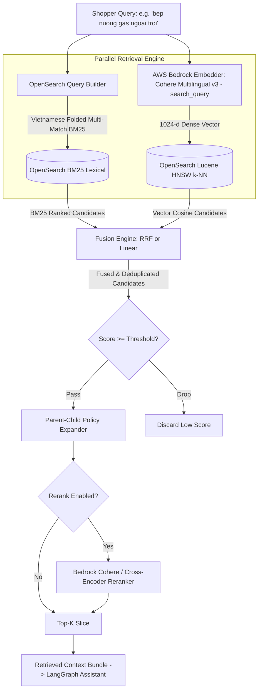

# Hybrid Retrieval & Re-ranking Specification

**Spec ID**: `SPEC-0003`  
**Status**: `Draft`  
**Author**: Antigravity & User  
**Date**: 2026-09-18  
**Parent Spec**: [`specs/00-system-spec.md`](file:///home/ngthuan/projects/sales-assistant/specs/00-system-spec.md), [`specs/01-ecommerce-assistant-spec.md`](file:///home/ngthuan/projects/sales-assistant/specs/01-ecommerce-assistant-spec.md)  
**Related Specs**: [`specs/02-ingestion-indexing-pipeline-spec.md`](file:///home/ngthuan/projects/sales-assistant/specs/02-ingestion-indexing-pipeline-spec.md)

---

## 1. Problem Statement & Motivation

### 1.1 Context
In the Sales Assistant architecture, customer inquiries range from precise technical requests (e.g., exact SKU codes like `"BBQ-GAS-01"`, brand names like `"Weber"`, or specific dimensions) to fuzzy semantic inquiries (e.g., `"bếp dùng ngoài trời cho gia đình 4 người"` or `"chính sách đổi trả hàng bị lỗi"`). 

Furthermore, Vietnamese e-commerce search presents unique challenges:
1. **Diacritic & Tone Variations**: Shoppers frequently omit tone marks (e.g., typing `"bep nuong ga ngoai troi"` instead of `"bếp nướng gas ngoài trời"`).
2. **Compound Term Semantics**: Vietnamese words often span multiple tokens (e.g., `"nồi chiên không dầu"`), where pure BM25 can match disjointed terms, while pure dense vector retrieval may miss exact part numbers or brand variants.
3. **Multi-Domain Granularity**: Products require structured metadata filtering (price, stock, category), promotions require threshold and validity checking, and policies require parent-child context expansion so the LLM receives the full policy section without losing chunk retrieval precision.

To achieve $\ge 85\%$ Hit Rate @ 3 and sub-150ms retrieval latency, we require a dedicated, high-performance **Hybrid Retrieval & Re-ranking Engine** backed by Amazon OpenSearch Service and AWS Bedrock.

### 1.2 User Story
As an e-commerce conversational assistant (and backend engineer testing via REST), I want a unified retrieval module that executes hybrid search (BM25 with Vietnamese accent-folding + Lucene HNSW k-NN vectors), fuses scores via Reciprocal Rank Fusion (RRF) or linear weighting, applies metadata filters (category, stock, price), expands parent-child policy contexts, and optionally re-ranks candidate chunks, so that the assistant receives high-precision, grounded context with zero hallucinations.

### 1.3 Non-Goals / Out of Scope
- **Final LLM Response Generation**: Governed by `SPEC-0001` (LangGraph assistant workflow and prompt synthesis).
- **Index Lifecycle & Chunk Ingestion**: Governed by `SPEC-0002` (crawling, chunking, Bedrock bulk embedding, and CDC indexing).
- **Live Inventory Mutation**: Real-time stock reservation or checkout cart mutations (retrieval inspects catalog stock status; real-time transactional locking is handled by downstream order systems).

---

## 2. Technical Architecture & Data Contracts

### 2.1 Data Models & Schemas (`src/retrieval/models.py`)

```python
from __future__ import annotations

from dataclasses import dataclass, field
from datetime import datetime
from enum import Enum
from typing import Any, Dict, List, Literal, Optional


class SearchType(str, Enum):
    """Retrieval execution strategy."""
    HYBRID = "hybrid"
    VECTOR = "vector"
    LEXICAL = "lexical"


class FusionAlgorithm(str, Enum):
    """Rank fusion algorithm used to merge BM25 and dense vector results."""
    RRF = "rrf"  # Reciprocal Rank Fusion
    LINEAR_COMBINATION = "linear"  # Normalized weighted sum: alpha * dense + (1 - alpha) * bm25


class RerankerType(str, Enum):
    """Reranker implementation."""
    NONE = "none"
    BEDROCK_COHERE = "bedrock_cohere"
    CROSS_ENCODER = "cross_encoder"


@dataclass
class FilterCriteria:
    """Structured search filters for OpenSearch queries."""
    category: Optional[Literal["product", "promotion", "policy"]] = None
    stock_status: Optional[Literal["in_stock", "out_of_stock", "backorder"]] = None
    min_price: Optional[float] = None
    max_price: Optional[float] = None
    policy_type: Optional[Literal["shipping", "returns", "warranty", "privacy", "terms"]] = None
    promo_code: Optional[str] = None
    source_prefix: Optional[str] = None


@dataclass
class RetrievalQuery:
    """Input query specification for hybrid retrieval."""
    query: str
    search_type: SearchType = SearchType.HYBRID
    top_k: int = 5
    filters: Optional[FilterCriteria] = None
    fusion_algorithm: FusionAlgorithm = FusionAlgorithm.RRF
    rrf_k: int = 60
    hybrid_alpha: float = 0.5  # Weight of dense vector in linear fusion (0.0 = pure BM25, 1.0 = pure vector)
    score_threshold: float = 0.0  # Minimum similarity/fusion score cutoff
    expand_parent_context: bool = True  # If True, replace content with parent_section_content when available
    rerank: bool = False
    rerank_top_n: int = 10  # Initial candidates fetched before reranking down to top_k
    reranker_type: RerankerType = RerankerType.NONE


@dataclass
class RetrievedChunk:
    """Individual chunk hit retrieved and scored from OpenSearch."""
    chunk_id: str
    doc_id: str
    category: str
    content: str
    score: float
    lexical_score: Optional[float] = None
    vector_score: Optional[float] = None
    rerank_score: Optional[float] = None
    lexical_rank: Optional[int] = None
    vector_rank: Optional[int] = None
    chunk_index: int = 0
    metadata: Dict[str, Any] = field(default_factory=dict)
    parent_content: Optional[str] = None
    is_parent_expanded: bool = False


@dataclass
class RetrievalResult:
    """Full result bundle from the retrieval engine."""
    query: str
    search_type: SearchType
    total_hits: int
    chunks: List[RetrievedChunk]
    latency_ms: float
    retrieval_mode_used: str
    filters_applied: Dict[str, Any] = field(default_factory=dict)
```

---

### 2.2 Component Interactions & Retrieval Pipeline



---

### 2.3 Retrieval Algorithms & Core Parameters

#### 2.3.1 Bedrock Embedding for Search Queries
- In `SPEC-0002`, documents were embedded with `input_type="search_document"`.
- At query time, `BedrockEmbedder.embed_text(query, input_type="search_query")` **must** be used to ensure asymmetrical retrieval alignment in Cohere Multilingual v3 (1024-d).

#### 2.3.2 OpenSearch Query Construction
1. **Lexical BM25 Clause**:
   - Matches against both standard and accent-folded fields:
     - `metadata.product_name^3.0`
     - `metadata.product_name.folded^2.5`
     - `content^2.0`
     - `content.folded^1.5`
   - Uses `operator="or"` with `minimum_should_match="2<75%"` to balance precision and recall on multi-word Vietnamese queries.
2. **Dense k-NN Clause**:
   - `knn` query against `embedding` vector:
     - `vector`: 1024-d float array from Bedrock
     - `k`: Candidate size ($\max(top\_k \times 2, 20)$)
3. **Structured Filters**:
   - Executed inside the OpenSearch `bool.filter` block (cached, zero impact on BM25 relevance scoring):
     - `term: { "category": criteria.category }`
     - `term: { "metadata.stock_status": criteria.stock_status }`
     - `range: { "metadata.price": { "gte": min_p, "lte": max_p } }`
     - `term: { "metadata.policy_type": criteria.policy_type }`

#### 2.3.3 Fusion Strategies

##### Strategy A: Reciprocal Rank Fusion (RRF) - Default
For each document $d$ present in candidate lists $R_{bm25}$ and $R_{vector}$:
$$RRF(d) = \sum_{m \in \{bm25, vector\}} \frac{1}{k + r_m(d)}$$
Where:
- $k = 60$ (smoothing constant preventing high-rank outliers from dominating).
- $r_m(d)$ is the 1-based rank of document $d$ in system $m$. If not present in a system's top hits, it receives rank $\infty$ (score 0 for that system).

##### Strategy B: Min-Max Normalized Linear Combination
For queries requiring explicit weight tuning:
$$S_{norm}(d) = \frac{S(d) - S_{min}}{S_{max} - S_{min} + \epsilon}$$
$$S_{hybrid}(d) = \alpha \cdot S_{norm, vector}(d) + (1 - \alpha) \cdot S_{norm, bm25}(d)$$
Where $\alpha \in [0.0, 1.0]$ defaults to $0.5$.

#### 2.3.4 Parent-Child Small-to-Big Context Expansion
When a retrieved chunk belongs to `category="policy"` and contains `metadata.parent_section_content`:
- If `expand_parent_context=True`, the chunk's `content` presented to the downstream LLM is replaced by `parent_section_content`, while `is_parent_expanded` is set to `True`.
- This provides the LLM with complete policy conditions (e.g. exceptions, warranty time limits) while maintaining the granular search indexability of individual policy paragraphs.

---

## 3. Interfaces & Architecture Contracts

### 3.1 Module Hierarchy (`src/retrieval/`)

```
src/retrieval/
├── __init__.py                # Package exports (OpenSearchHybridRetriever, RetrievalQuery, etc.)
├── models.py                  # Pydantic & dataclass schemas for query, filters, results
├── query_builder.py           # OpenSearch DSL query generator (BM25, k-NN, filters)
├── fusion.py                  # RRF and Min-Max score normalization algorithms
├── reranker.py                # BaseReranker, BedrockCohereReranker, NoOpReranker
├── retriever.py               # BaseRetriever and OpenSearchHybridRetriever core service
└── service.py                 # High-level RetrievalService orchestrating cache, telemetry, and metrics
```

### 3.2 Public Python Method Signatures

```python
class BaseRetriever(ABC):
    """Abstract interface for Sales Assistant knowledge retrieval."""
    
    @abstractmethod
    def retrieve(self, query: RetrievalQuery) -> RetrievalResult:
        """Executes retrieval according to the provided query specification."""
        pass
    
    @abstractmethod
    async def aretrieve(self, query: RetrievalQuery) -> RetrievalResult:
        """Asynchronous retrieval execution."""
        pass


class OpenSearchHybridRetriever(BaseRetriever):
    """Production hybrid retriever combining OpenSearch BM25 + Bedrock k-NN."""
    
    def __init__(
        self,
        opensearch_client: Optional[OpenSearch] = None,
        embedder: Optional[BaseEmbedder] = None,
        reranker: Optional[BaseReranker] = None,
        index_name: Optional[str] = None,
        default_top_k: int = 5,
        default_alpha: float = 0.5,
    ) -> None:
        ...

    def retrieve(self, query: RetrievalQuery) -> RetrievalResult:
        ...

    async def aretrieve(self, query: RetrievalQuery) -> RetrievalResult:
        ...

    def search_by_product_id(self, product_id: str) -> Optional[RetrievedChunk]:
        """Direct point lookup for deterministic product verification."""
        ...

    def search_promotions(self, min_spend: Optional[float] = None) -> List[RetrievedChunk]:
        """Retrieves currently active coupons matching spend criteria."""
        ...
```

### 3.3 REST API Specification (`src/api/v1/endpoints/retrieval.py`)

The retrieval engine provides dedicated REST verification endpoints to inspect retrieval quality, rank scoring, and re-ranking performance directly via OpenAPI Swagger UI (`/docs`).

#### 3.3.1 `POST /api/v1/retrieval/search`
- **Purpose**: Primary hybrid retrieval endpoint for assistant orchestration and manual verification.
- **Request Body**:
  ```json
  {
    "query": "bep nuong gas ngoai troi cao cap",
    "search_type": "hybrid",
    "top_k": 5,
    "filters": {
      "category": "product",
      "stock_status": "in_stock",
      "min_price": 2000000.0,
      "max_price": 15000000.0
    },
    "fusion_algorithm": "rrf",
    "rrf_k": 60,
    "score_threshold": 0.01,
    "expand_parent_context": true,
    "rerank": false
  }
  ```
- **Response**: `200 OK`
  ```json
  {
    "success": true,
    "message": "Retrieved 3 chunks in 42.5ms",
    "data": {
      "query": "bep nuong gas ngoai troi cao cap",
      "search_type": "hybrid",
      "total_hits": 3,
      "latency_ms": 42.5,
      "retrieval_mode_used": "hybrid_rrf",
      "chunks": [
        {
          "chunk_id": "chunk_7f8a9b1c",
          "doc_id": "doc_bep_gas_01",
          "category": "product",
          "score": 0.0328,
          "lexical_score": 14.82,
          "vector_score": 0.824,
          "lexical_rank": 1,
          "vector_rank": 2,
          "content": "Tên sản phẩm: Bếp nướng gas ngoài trời BBQ...",
          "metadata": {
            "product_name": "Bếp nướng gas ngoài trời BBQ 4 họng",
            "price": 8500000.0,
            "currency": "VND",
            "stock_status": "in_stock",
            "source_url": "https://bepbbq.com/san-pham/bep-nuong-gas-01"
          },
          "is_parent_expanded": false
        }
      ]
    }
  }
  ```

#### 3.3.2 `POST /api/v1/retrieval/explain`
- **Purpose**: Diagnostics endpoint providing transparent visibility into score calculations (raw BM25 score, raw vector cosine distance, intermediate RRF reciprocal ranks, and final merged ordering).

#### 3.3.3 `GET /api/v1/retrieval/health`
- **Purpose**: Diagnostics check confirming OpenSearch connectivity, target index existence, mapping status, and Bedrock embedding API availability.

---

## 4. Edge Cases & Error Handling

1. **Tone-Mark Resiliency (Vietnamese Diacritics)**:
   - Queries like `"noi chien khong dau"` must match indexed documents containing `"Nồi chiên không dầu"`. The OpenSearch query builder targets both the raw `content` field and the `.folded` subfield generated with `vietnamese_ascii_analyzer`.
2. **SKU & Alphanumeric Model Codes**:
   - Exact SKU queries (e.g. `"BBQ-104-SS"`) often produce low semantic vector similarities. BM25 boosting (`metadata.product_name^3.0` and exact keyword matching) ensures that precise codes achieve Rank 1 in hybrid RRF.
3. **Empty / Whitespace / Punctuation Queries**:
   - Validation rejects empty or whitespace-only queries with HTTP 400 (`Query string cannot be empty`).
4. **Zero Relevant Hits / Sub-Threshold Results**:
   - If no candidates exceed `score_threshold`, return an empty list gracefully (`total_hits: 0, chunks: []`) with HTTP 200 rather than throwing an exception.
5. **Bedrock Throttling or Outage**:
   - If AWS Bedrock embedding fails (e.g. transient 500 or throttling `ThrottlingException`), the retriever must log a warning and **gracefully degrade to pure BM25 lexical search**, returning results with a warning flag instead of crashing the customer session.
6. **Parent-Child Missing Parent**:
   - If `expand_parent_context=True` but `metadata.parent_section_content` is null or empty, the retriever falls back to the original chunk `content`.

---

## 5. Acceptance Criteria & Evaluation Plan

### 5.1 Automated Acceptance Criteria
- [ ] **Unit Tests**:
  - `tests/test_opensearch_query_builder.py`: Validates generated OpenSearch JSON query DSL for hybrid, vector, BM25, and metadata filters.
  - `tests/test_fusion.py`: Tests RRF ranking correctness, tie-breaking, and linear min-max normalization.
  - `tests/test_retrieval_models.py`: Validates Pydantic/dataclass serialization, deserialization, and filter constraints.
- [ ] **Integration Tests**:
  - `tests/test_opensearch_hybrid_retriever.py`: End-to-end tests against OpenSearch mock and live index.
  - `tests/test_retrieval_api.py`: FastAPI test client testing `/api/v1/retrieval/search`, `/explain`, and `/health`.
  - `tests/test_retrieval_fallback.py`: Verifies graceful fallback to BM25 if Bedrock query embedding raises an error.

### 5.2 RAG Quality Metrics (`rag-eval` Skill)
Benchmarked via `.agent/skills/rag-eval/scripts/eval_retrieval.py` against `tests/fixtures/eval_dataset.json`:
- **Hit Rate @ 3**: $\ge 85\%$ (Target $\ge 90\%$ for product inquiries).
- **Mean Reciprocal Rank (MRR)**: $\ge 0.75$.
- **P95 Retrieval Latency**: $\le 150\text{ ms}$ for hybrid retrieval without reranking; $\le 400\text{ ms}$ with re-ranking.
- **Tone-mark Equivalence**: Hit rate delta between accented and unaccented queries $\le 5\%$.

---

## 6. Open Questions & Trade-offs (To be refined via `/grill-me`)

1. **Fusion Layer: Client-Side RRF vs OpenSearch Search Pipeline**:
   - *Option A (Recommended for Phase 1)*: Execute separate BM25 and k-NN queries (or a single `bool.should` query) and perform RRF in Python (`src/retrieval/fusion.py`). Provides complete transparency, custom debugging, and zero cluster pipeline configuration overhead.
   - *Option B*: Configure OpenSearch `search-pipeline` with native normalization and combination processors.
2. **Re-ranker Strategy**:
   - *Option A*: AWS Bedrock Cohere Rerank (`cohere.rerank-v3-5:0`) via Bedrock runtime API.
   - *Option B*: Local cross-encoder (`sentence-transformers`) running in process.
   - *Option C*: Optional/disabled by default for low latency, enabled only for ambiguous or multi-constraint queries.
3. **Parent Context Injection Limit**:
   - For long policy documents, how large can `parent_section_content` be before it blows out the LLM synthesis context window? Suggested cap: 1,500 characters.
