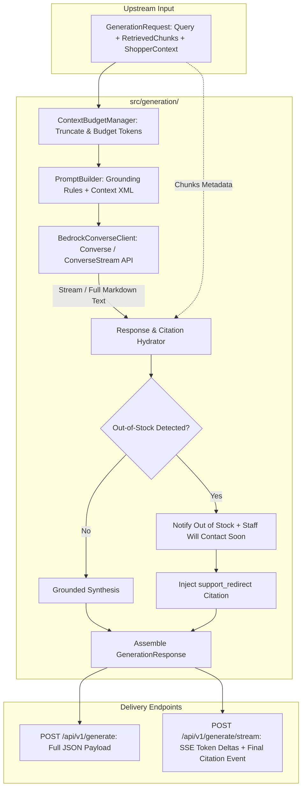

# Bedrock LLM Grounded Response Generation Specification

**Spec ID**: `SPEC-0004`  
**Status**: `Approved / Aligned via /grill-me`  
**Author**: Antigravity & Engineering Team  
**Date**: 2026-09-19  
**Parent Specs**: [`specs/00-system-spec.md`](file:///home/ngthuan/projects/sales-assistant/specs/00-system-spec.md), [`specs/01-ecommerce-assistant-spec.md`](file:///home/ngthuan/projects/sales-assistant/specs/01-ecommerce-assistant-spec.md)  
**Related Specs**: [`specs/02-ingestion-indexing-pipeline-spec.md`](file:///home/ngthuan/projects/sales-assistant/specs/02-ingestion-indexing-pipeline-spec.md), [`specs/03-hybrid-retrieval-reranking-spec.md`](file:///home/ngthuan/projects/sales-assistant/specs/03-hybrid-retrieval-reranking-spec.md)

---

## 1. Problem Statement & Motivation

### 1.1 Context
In the Sales Assistant architecture, the hybrid retrieval and re-ranking subsystem (`SPEC-0003`) returns top-$K$ candidate chunks (`RetrievedChunk`) from OpenSearch Serverless with high semantic and lexical recall. However, raw search chunks cannot be presented directly to an online shopper:
1. **Conversational Synthesis**: Shoppers expect a warm, consultative, and natural dialogue in Vietnamese (with full diacritic fluency) or English, directly answering their question without conversational robotic artifacts or raw Markdown dump.
2. **Strict Grounding & Zero Hallucination**: The LLM must not invent prices, speculate on unmentioned product specs, promise non-existent warranties, or confirm coupons that do not exist or are expired.
3. **E-Commerce Domain Rules & Determinism**:
   - **Promotions (Phase 1)**: Must identify and notify shoppers of eligible promotions found in the retrieved context, explain the conditions (minimum spend, dates, discount), and strictly include the disclaimer: *"Lưu ý: Các mã giảm giá không thể kết hợp hoặc cộng dồn trong cùng một đơn hàng"* ("Please note that promotional codes cannot be combined or stacked at checkout"). In this phase, the assistant does *not* calculate the final checkout price.
   - **Out-of-Stock Notification**: When a queried item is out of stock (or backordered), the assistant politely informs the shopper that the item is currently out of stock and that our store staff will contact them soon, accompanied by a verified Customer Support redirect CTA (`https://store.example.com/support`).
   - **Policy Answers**: Must ground all return, shipping, and warranty statements upon official policy chunks and supply verified policy URLs.
4. **Hybrid Citation Mapping**: Frontend UI clients need both natural Markdown text for chat and structured typed `Citation` objects for interactive UI cards. The prompt instructs the LLM to cite referenced context chunks (e.g., `[1]`, `[2]`), and the backend deterministically hydrates the cited chunks using verified OpenSearch metadata.

### 1.2 User Story
As an e-commerce customer assistant runtime (and REST API consumer), I want a Bedrock-powered response generation engine that takes retrieved context chunks (`RetrievedChunk`), shopper cart state (`ShopperContext`), and inquiry query, enforces prompt token budgeting, invokes AWS Bedrock models via the Converse API (`anthropic.claude-3-5-sonnet-20240620-v1:0` by default), derives typed citations via hybrid hydration, and outputs a validated `GenerationResponse` with both synchronous JSON and Server-Sent Events (SSE) streaming capabilities.

### 1.3 Non-Goals / Out of Scope
- **Final Cart Price Calculation (Phase 1)**: In Phase 1, the assistant identifies eligible coupons and explains terms; calculating final checkout discounted subtotal is deferred to cart checkout integration.
- **Direct Database / OpenSearch Querying**: Retrieval is handled strictly upstream by `SPEC-0003` (`RetrievalService`).
- **Transactional Cart Mutation / Checkout Processing**: Real-time payment or credit card processing is out of scope; assistant provides checkout CTA links.

---

## 2. Technical Architecture & Data Contracts

### 2.1 Subsystem Placement

The Generation subsystem resides in `src/generation/`:
```
src/generation/
├── __init__.py
├── models.py            # GenerationRequest, GenerationResponse, Citation, CitationType, etc.
├── prompts.py           # System prompts, prompt builders, category-specific few-shots & constraints
├── budget.py            # Token budget manager and context window trimmer
├── bedrock_client.py    # AWS Bedrock Converse API abstraction (Claude 3.5 Sonnet / Nova) with SigV4
├── citation_extractor.py # Hybrid citation hydrator mapping [1], [2] to verified chunk metadata
├── generator.py         # GroundedResponseGenerator orchestrating budget, prompt, LLM & citations
└── service.py           # GenerationService facade with sync and streaming (SSE) capabilities
```

### 2.2 Component Interaction & Data Flow



### 2.3 Data Models & Schemas (`src/generation/models.py`)

```python
from __future__ import annotations

from dataclasses import dataclass, field
from datetime import datetime
from enum import Enum
from typing import Any, Dict, List, Literal, Optional

from src.retrieval.models import RetrievedChunk


class CitationType(str, Enum):
    """Types of structured citations generated for frontend UI components."""
    PRODUCT_CTA = "product_cta"
    POLICY_LINK = "policy_link"
    PROMO_TERMS = "promo_terms"
    SUPPORT_REDIRECT = "support_redirect"


@dataclass
class CartItem:
    """Shopper's current cart item for promotion & stock evaluation."""
    sku: str
    product_id: str
    name: str
    price: float
    quantity: int = 1


@dataclass
class ShopperContext:
    """Shopper session context passed to generator."""
    cart_items: List[CartItem] = field(default_factory=list)
    cart_subtotal: float = 0.0
    current_time: datetime = field(default_factory=datetime.utcnow)
    locale: str = "vi_VN"  # "vi_VN" or "en_US"
    user_id: Optional[str] = None


@dataclass
class Citation:
    """Structured UI citation card object."""
    citation_type: CitationType
    title: str
    url: str
    price_display: Optional[str] = None
    stock_status: Optional[str] = None  # in_stock, out_of_stock, backorder
    promo_code: Optional[str] = None
    discount_display: Optional[str] = None
    metadata: Dict[str, Any] = field(default_factory=dict)

    def to_dict(self) -> Dict[str, Any]:
        """Serialize citation to dict."""
        return {k: v for k, v in self.__dict__.items() if v is not None}


@dataclass
class GenerationConfig:
    """Inference parameter overrides for AWS Bedrock."""
    model_id: str = "anthropic.claude-3-5-sonnet-20240620-v1:0"
    temperature: float = 0.1  # Low temperature for strict factual grounding
    top_p: float = 0.9
    max_tokens: int = 1500
    stop_sequences: List[str] = field(default_factory=list)
    system_prompt_override: Optional[str] = None


@dataclass
class GenerationRequest:
    """Input payload to the generation subsystem."""
    query: str
    chunks: List[RetrievedChunk]
    shopper_context: Optional[ShopperContext] = None
    config: Optional[GenerationConfig] = None
    conversation_history: List[Dict[str, str]] = field(default_factory=list)
    require_citations: bool = True


@dataclass
class TokenUsage:
    """Token consumption telemetry."""
    input_tokens: int = 0
    output_tokens: int = 0
    total_tokens: int = 0


@dataclass
class GenerationResponse:
    """Final output response bundle with text, citations, and telemetry."""
    query: str
    answer: str  # Markdown text for conversational display
    citations: List[Citation]
    model_id: str
    refusal_triggered: bool = False
    refusal_reason: Optional[str] = None
    support_redirect_url: Optional[str] = None
    token_usage: TokenUsage = field(default_factory=TokenUsage)
    latency_ms: float = 0.0
    degraded: bool = False
    degradation_reason: Optional[str] = None

    def to_dict(self) -> Dict[str, Any]:
        """Convert response to dictionary for REST API serialization."""
        return {
            "query": self.query,
            "answer": self.answer,
            "citations": [c.to_dict() for c in self.citations],
            "model_id": self.model_id,
            "refusal_triggered": self.refusal_triggered,
            "refusal_reason": self.refusal_reason,
            "support_redirect_url": self.support_redirect_url,
            "token_usage": self.token_usage.__dict__,
            "latency_ms": round(self.latency_ms, 2),
            "degraded": self.degraded,
            "degradation_reason": self.degradation_reason,
        }
```

---

## 3. Grounded Prompt Engineering & Guardrails

### 3.1 Grounding Instructions (`src/generation/prompts.py`)

The system prompt enforces five non-negotiable grounding directives:
1. **Source Exclusivity & Bracketed Citations**:
   - Synthesize answers **strictly and exclusively** using facts provided in `<retrieved_context>`.
   - Each retrieved chunk is presented with an index like `[1]`, `[2]`.
   - The LLM cites sources inline using bracketed notation `[1]`, `[2]` when referencing specific information.
   - If the retrieved context does not contain the answer, explicitly state that the store does not have that information and redirect to Customer Support. Never speculate or invent details.
2. **Vietnamese Language & Tone**:
   - Respond naturally in Vietnamese by default (or the shopper's inquiry language), maintaining a polite, helpful, and professional retail sales assistant tone (*"Dạ chào bạn, theo thông tin của cửa hàng..."*).
3. **Promotion Guidance (Phase 1)**:
   - Identify and inform the customer of all eligible promotions found in context matching their cart or inquiry.
   - Clearly state the discount terms, minimum spend, and validity period.
   - Do *not* calculate the final checkout price in this phase.
   - ALWAYS include the mandatory disclaimer: *"Lưu ý: Các mã giảm giá không thể kết hợp hoặc cộng dồn trong cùng một đơn hàng."*
4. **Out-of-Stock Notification Policy**:
   - If a requested product is marked `out_of_stock` or `backorder`, notify the shopper clearly:
     *"Sản phẩm hiện đang tạm hết hàng. Nhân viên cửa hàng sẽ sớm liên hệ lại với bạn để hỗ trợ thông tin nhập hàng/đặt trước."*
   - Direct the customer to Customer Support via the support redirect CTA (`https://store.example.com/support`).
5. **Format & Safety**:
   - Clean Markdown with bullet points; do not expose internal vector scores, chunk IDs, or raw embeddings.

### 3.2 Context Budget Management (`src/generation/budget.py`)

- **Context Window Budget**: AWS Bedrock Claude 3.5 Sonnet supports 200k tokens; for fast response times ($\le 1200\text{ ms}$), the target context budget is capped at **4,000 input tokens** ($\approx 12,000$ Vietnamese characters).
- **Pruning Strategy**:
  1. Top-ranked chunks from `SPEC-0003` are prioritized.
  2. For policy chunks with `is_parent_expanded=True`, parent content is capped at 2,000 characters as defined in `SPEC-0003`.
  3. If total context exceeds 4,000 tokens, lowest-ranked chunks are omitted from the LLM prompt while preserving top-$K$ relevance.

---

## 4. Bedrock Client & Citation Hydration

### 4.1 Bedrock Converse API Wrapper (`src/generation/bedrock_client.py`)

Using the AWS Bedrock **Converse API** (`bedrock-runtime.converse` and `bedrock-runtime.converse_stream`):
- Provides a unified message schema (`role: "user" | "assistant"`).
- Automatically supports both Anthropic Claude models (`anthropic.claude-3-5-sonnet-20240620-v1:0` by default) and Amazon Nova models (`amazon.nova-pro-v1:0`).
- Captures `usage` metrics (`inputTokens`, `outputTokens`, `totalTokens`).
- Handles AWS SigV4 authentication via `boto3.Session` using `AWS_REGION` and configured credentials.

```python
class BaseBedrockClient(ABC):
    """Abstract interface for Bedrock model interaction."""
    @abstractmethod
    def converse(
        self,
        messages: List[Dict[str, Any]],
        system_prompts: List[Dict[str, str]],
        inference_config: Dict[str, Any],
    ) -> Dict[str, Any]:
        """Execute non-streaming Converse API request."""
        pass

    @abstractmethod
    def converse_stream(
        self,
        messages: List[Dict[str, Any]],
        system_prompts: List[Dict[str, str]],
        inference_config: Dict[str, Any],
    ) -> Iterator[str]:
        """Execute streaming Converse API request, yielding text chunks."""
        pass
```

### 4.2 Hybrid Citation Hydration (`src/generation/citation_extractor.py`)

To prevent LLM hallucination of URLs, prices, or promotion codes, citations are extracted **deterministically from the verified chunk metadata**:
1. **Bracket Detection**: The extractor inspects the synthesized response text for bracketed references (e.g. `[1]`, `[2]`).
2. **Deterministic Hydration**:
   - For cited index $i$, the corresponding `RetrievedChunk` metadata is hydrated into a structured `Citation`:
     - **Product Chunks (`category == "product"`)**: `CitationType.PRODUCT_CTA`, title, URL, formatted price, `stock_status`.
     - **Policy Chunks (`category == "policy"`)**: `CitationType.POLICY_LINK`, section title, verified policy URL.
     - **Promotion Chunks (`category == "promotion"`)**: `CitationType.PROMO_TERMS`, promo code, discount display, terms URL.
3. **Fallback Rule**: If no bracketed citations are detected in the LLM text, the extractor safely falls back to hydrating the top-ranked chunks.
4. **Refusal / Out-of-Stock Injection**:
   - Whenever an out-of-stock item or refusal condition is flagged, injects `CitationType.SUPPORT_REDIRECT`:
     - `title`: `"Trung tâm hỗ trợ khách hàng"`
     - `url`: `"https://store.example.com/support"`

---

## 5. Edge Cases & Error Handling

| Scenario | System Behavior | Telemetry / Output |
| :--- | :--- | :--- |
| **Empty Retrieved Chunks** | Informs user that the store catalog does not have matching info; provides support link. | `refusal_triggered=True`, `support_redirect_url="https://store.example.com/support"`. |
| **Out-of-Stock Product Query** | Identifies `stock_status == "out_of_stock"`; informs user item is out of stock and staff will contact soon. | `refusal_triggered=True`, `refusal_reason="product_out_of_stock"`. |
| **Invalid or Expired Coupon** | Informs user coupon is expired/invalid; mentions eligible active promotions if present; includes no-stacking disclaimer. | `refusal_triggered=True` if specific code requested was invalid. |
| **Bedrock Throttling (`ThrottlingException`)** | Exponential backoff retry (up to 3 attempts with jitter). If exhausted, returns fallback graceful message. | `degraded=True`, `degradation_reason="bedrock_throttled"`. |
| **Bedrock Service Error / Timeout** | Catches `ClientError` / `EndpointConnectionError`; returns fallback response directing customer to support. | `degraded=True`, `degradation_reason="bedrock_unavailable"`. |
| **Context Length Exceeded** | `ContextBudgetManager` drops lower-ranked chunks until total input tokens $\le 4,000$. | Logs warning; retains top relevance. |

---

## 6. Acceptance Criteria & Evaluation Plan

### 6.1 Automated Acceptance Criteria
- [ ] **Unit Tests (`tests/test_generation_models.py`)**:
  - `GenerationRequest`, `GenerationResponse`, `Citation`, `ShopperContext` serialization and deserialization.
- [ ] **Prompt Builder Tests (`tests/test_generation_prompts.py`)**:
  - Validates system prompt injection of Vietnamese tone guidelines, promotion rules, context formatting with `[1]`, `[2]`.
  - Verifies dynamic token trimming in `ContextBudgetManager`.
- [ ] **Citation Hydrator Tests (`tests/test_citation_extractor.py`)**:
  - Asserts cited bracketed markers hydrate the correct chunk metadata.
  - Tests fallback hydration when no bracketed numbers are output.
  - Verifies support redirect citation injection on out-of-stock items.
- [ ] **Bedrock Client Mock Tests (`tests/test_bedrock_generator.py`)**:
  - Uses `botocore.stub.Stubber` or `unittest.mock` to simulate Bedrock Converse API response and streaming.
  - Tests non-streaming `generate()` and streaming `generate_stream()`.
  - Asserts graceful fallback on `ThrottlingException` or `ClientError`.
- [ ] **API Endpoint Tests (`tests/test_generation_api.py`)**:
  - Tests synchronous `POST /api/v1/generate` returning 200 JSON payload.
  - Tests streaming `POST /api/v1/generate/stream` returning Server-Sent Events (SSE).

### 6.2 RAG Quality & Benchmark Targets (`.agent/skills/rag-eval`)
- **Faithfulness / Groundedness**: **$100\%$ ($1.0$)** — Zero hallucinated prices, specs, or coupon percentages.
- **Answer Relevance**: $\ge 90\%$ based on RAG evaluation test set.
- **Latency Budget**: Bedrock generation step $\le 1200\text{ ms}$ (P95).
- **Refusal Accuracy**: $100\%$ on out-of-stock items and invalid discount claims.

---

## 7. Grill-Me Alignment Log

During the `/grill-me` architectural review session on 2026-09-19, the following key design decisions were aligned and approved:
1. **Foundation Model**: `anthropic.claude-3-5-sonnet-20240620-v1:0` selected as the primary default via Bedrock Converse API, while maintaining a model-agnostic client structure for easy parameter-based overrides (e.g. Amazon Nova Pro).
2. **Citation Hydration**: Adopted Hybrid Citation Mapping. The LLM is instructed to cite chunks via bracketed notation (`[1]`, `[2]`), and `CitationExtractor` deterministically hydrates the referenced chunks with verified OpenSearch metadata (with fallback to top-ranked chunks if no markers are emitted).
3. **Out-of-Stock Policy**: When an item is out of stock, the assistant notifies the customer that the product is temporarily out of stock and that store staff will contact them soon, accompanied by a Customer Support redirect CTA.
4. **API Endpoints**: Dual delivery supported: synchronous JSON (`POST /api/v1/generate`) and SSE streaming (`POST /api/v1/generate/stream`).
5. **Promotion Evaluation (Phase 1)**: The assistant notifies the customer of eligible promotions found in context and their terms, emphasizes the mandatory no-stacking disclaimer, and does *not* calculate final checkout cart price in this phase.
