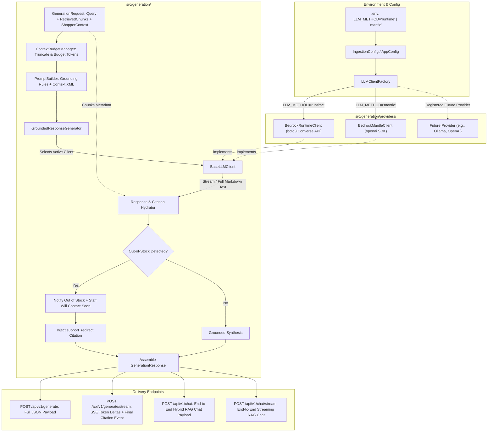

# LLM Grounded Response Generation Specification (Bedrock Runtime & Mantle)

**Spec ID**: `SPEC-0004`  
**Status**: `Approved / Aligned via /grill-me (Revision 2: Multi-Method LLM Engine)`  
**Author**: Antigravity & Engineering Team  
**Date**: 2026-09-20  
**Parent Specs**: [`specs/00-system-spec.md`](file:///home/ngthuan/projects/sales-assistant/specs/00-system-spec.md), [`specs/01-ecommerce-assistant-spec.md`](file:///home/ngthuan/projects/sales-assistant/specs/01-ecommerce-assistant-spec.md)  
**Related Specs**: [`specs/02-ingestion-indexing-pipeline-spec.md`](file:///home/ngthuan/projects/sales-assistant/specs/02-ingestion-indexing-pipeline-spec.md), [`specs/03-hybrid-retrieval-reranking-spec.md`](file:///home/ngthuan/projects/sales-assistant/specs/03-hybrid-retrieval-reranking-spec.md)

---

## 1. Problem Statement & Motivation

### 1.1 Context
In the Sales Assistant architecture, the hybrid retrieval and re-ranking subsystem (`SPEC-0003`) returns top-$K$ candidate chunks (`RetrievedChunk`) from OpenSearch Serverless with high semantic and lexical recall. However, raw search chunks cannot be presented directly to an online shopper:
1. **Conversational Synthesis**: Shoppers expect a warm, consultative, and natural dialogue in Vietnamese (with full diacritic fluency) or English, directly answering their question without conversational robotic artifacts or raw Markdown dump.
2. **Strict Grounding & Zero Hallucination**: The LLM must not invent prices, speculate on unmentioned product specs, promise non-existent warranties, or confirm coupons that do not exist or are expired.
3. **E-Commerce Domain Rules & Determinism**:
   - **Promotions (Phase 1)**: Must identify and notify shoppers of eligible promotions found in the retrieved context, explain the conditions (minimum spend, dates, discount), and strictly include the disclaimer: *"Lưu ý: Các mã giảm giá không thể kết hợp hoặc cộng dồn trong cùng một đơn hàng"* ("Please note that promotional codes cannot be combined or stacked at checkout"). In this phase, the assistant does *not* calculate the final checkout price.
   - **Out-of-Stock Notification**: When a queried item is out of stock (or backordered), the assistant politely informs the shopper that the item is currently out of stock and that our store staff will contact them soon, accompanied by a verified Customer Support redirect CTA (`https://store.example.com/support`).
   - **Policy Answers**: Must ground all return, shipping, and warranty statements upon official policy chunks and supply verified policy URLs.
4. **Hybrid Citation Mapping**: Frontend UI clients need both natural Markdown text for chat and structured typed `Citation` objects for interactive UI cards. The prompt instructs the LLM to cite referenced context chunks (e.g., `[1]`, `[2]`), and the backend deterministically hydrates the cited chunks using verified OpenSearch metadata.
5. **Multi-Method LLM Extensibility**:
   - Different deployment and testing environments may require different LLM invocation backends:
     - **Bedrock Runtime (`"runtime"`)**: AWS Bedrock Converse API (`bedrock-runtime` via boto3) using AWS SigV4 credentials.
     - **Bedrock Mantle (`"mantle"`)**: High-throughput OpenAI-compatible API endpoint hosted on Bedrock Mantle infrastructure using `openai.OpenAI` client with API Key, Base URL, and Project ID authentication.
     - **Future Backends**: Pluggable architecture allowing future providers (e.g., direct OpenAI, Ollama, Anthropic, vLLM) without modifying core generator logic.
   - The active method must be toggleable seamlessly via a single environment variable key (`LLM_METHOD`) in `.env`.

### 1.2 User Story
As an e-commerce customer assistant runtime (and REST API consumer), I want a flexible, multi-backend response generation engine that:
- Configures and switches LLM invocation methods (AWS Bedrock Converse Runtime vs. Bedrock Mantle OpenAI-compatible gateway) via an environment variable (`LLM_METHOD`).
- Takes retrieved context chunks (`RetrievedChunk`), shopper cart state (`ShopperContext`), and inquiry query.
- Enforces prompt token budgeting and strict e-commerce grounding constraints.
- Derives typed citations via hybrid hydration.
- Outputs a validated `GenerationResponse` with both synchronous JSON and Server-Sent Events (SSE) streaming capabilities.

### 1.3 Non-Goals / Out of Scope
- **Final Cart Price Calculation (Phase 1)**: In Phase 1, the assistant identifies eligible coupons and explains terms; calculating final checkout discounted subtotal is deferred to cart checkout integration.
- **Direct Database / OpenSearch Querying**: Retrieval is handled strictly upstream by `SPEC-0003` (`RetrievalService`).
- **Transactional Cart Mutation / Checkout Processing**: Real-time payment or credit card processing is out of scope; assistant provides checkout CTA links.

---

## 2. Technical Architecture & Data Contracts

### 2.1 Subsystem Placement

The Generation subsystem resides in `src/generation/`:
```
src/generation/
├── __init__.py
├── models.py                 # GenerationRequest, GenerationResponse, Citation, CitationType, etc.
├── prompts.py                # System prompts, prompt builders, category-specific few-shots & constraints
├── budget.py                 # Token budget manager and context window trimmer
├── citation_extractor.py      # Hybrid citation hydrator mapping [1], [2] to verified chunk metadata
├── generator.py              # GroundedResponseGenerator orchestrating budget, prompt, LLM & citations
├── service.py                # GenerationService facade with sync and streaming (SSE) capabilities
└── providers/                # Pluggable LLM invocation backends
    ├── __init__.py
    ├── base.py               # BaseLLMClient abstract interface
    ├── factory.py            # LLMClientFactory & registry for provider resolution
    ├── runtime.py            # BedrockRuntimeClient (AWS Bedrock Converse API with SigV4)
    └── mantle.py             # BedrockMantleClient (OpenAI-compatible client for Bedrock Mantle)
```
*(Note: `src/generation/bedrock_client.py` is maintained as a backward-compatible alias to `providers/runtime.py` and `providers/base.py`.)*

### 2.2 Component Interaction & Data Flow



### 2.3 Configuration Variables & Environment Schema

The application configuration in `src/config.py` is expanded to manage provider selection and provider-specific parameters:

| Config Key | Type | Default | Description |
| :--- | :--- | :--- | :--- |
| `LLM_METHOD` | `str` | `"runtime"` | Method/backend for LLM inference: `"runtime"` or `"mantle"`. |
| **Runtime Settings** | | | |
| `BEDROCK_GENERATION_MODEL_ID` | `str` | `"anthropic.claude-3-5-sonnet-20240620-v1:0"` | Model ID for AWS Bedrock Converse API. |
| `BEDROCK_GENERATION_TEMPERATURE` | `float` | `0.1` | Temperature for response generation. |
| `BEDROCK_GENERATION_MAX_TOKENS` | `int` | `1500` | Maximum token output limit. |
| `BEDROCK_GENERATION_TIMEOUT_SECONDS` | `int` | `30` | Socket/read timeout for requests. |
| `AWS_REGION` | `str` | `"ap-southeast-1"` | AWS Region for Bedrock runtime client. |
| **Mantle Settings** | | | |
| `BEDROCK_MANTLE_API_KEY` | `str` | `""` | Authentication Bearer token for Bedrock Mantle gateway. |
| `BEDROCK_MANTLE_BASE_URL` | `str` | `""` | Base URL for Bedrock Mantle (e.g. `https://bedrock-mantle.ap-southeast-2.api.aws/v1`). |
| `BEDROCK_MANTLE_PROJECT_ID` | `str` | `"default"` | Project identifier, forwarded via HTTP headers or client init. |
| `BEDROCK_MANTLE_MODEL_ID` | `str` | `"openai.gpt-oss-120b"` | Default model ID for Bedrock Mantle calls. |

Example `.env` configuration snippet:
```bash
# LLM Provider Switch: "runtime" or "mantle"
LLM_METHOD=mantle

# Bedrock Runtime (Converse API)
BEDROCK_GENERATION_MODEL_ID=anthropic.claude-3-5-sonnet-20240620-v1:0
AWS_REGION=ap-southeast-1

# Bedrock Mantle (OpenAI-compatible API)
BEDROCK_MANTLE_API_KEY="ABSKTWFudGxlQXBpS2V5LXFmMGJ2aHpuLWF0..."
BEDROCK_MANTLE_BASE_URL="https://bedrock-mantle.ap-southeast-2.api.aws/v1"
BEDROCK_MANTLE_PROJECT_ID="default"
BEDROCK_MANTLE_MODEL_ID="openai.gpt-oss-120b"
```

### 2.4 Data Models & Schemas (`src/generation/models.py`)

```python
from __future__ import annotations

from dataclasses import dataclass, field
from datetime import datetime
from enum import Enum
from typing import Any, Dict, List, Literal, Optional

from src.retrieval.models import RetrievedChunk


class CitationType(str, Enum):
    """Types of structured citations generated for frontend UI components."""
    PRODUCT_CTA = "product_cta"
    POLICY_LINK = "policy_link"
    PROMO_TERMS = "promo_terms"
    SUPPORT_REDIRECT = "support_redirect"


@dataclass
class CartItem:
    """Shopper's current cart item for promotion & stock evaluation."""
    sku: str
    product_id: str
    name: str
    price: float
    quantity: int = 1


@dataclass
class ShopperContext:
    """Shopper session context passed to generator."""
    cart_items: List[CartItem] = field(default_factory=list)
    cart_subtotal: float = 0.0
    current_time: datetime = field(default_factory=datetime.utcnow)
    locale: str = "vi_VN"  # "vi_VN" or "en_US"
    user_id: Optional[str] = None


@dataclass
class Citation:
    """Structured UI citation card object."""
    citation_type: CitationType
    title: str
    url: str
    price_display: Optional[str] = None
    stock_status: Optional[str] = None  # in_stock, out_of_stock, backorder
    promo_code: Optional[str] = None
    discount_display: Optional[str] = None
    metadata: Dict[str, Any] = field(default_factory=dict)

    def to_dict(self) -> Dict[str, Any]:
        """Serialize citation to dict."""
        return {k: v for k, v in self.__dict__.items() if v is not None}


@dataclass
class GenerationConfig:
    """Inference parameter overrides for LLM invocation."""
    model_id: Optional[str] = None  # None = use provider default
    temperature: float = 0.1       # Low temperature for strict factual grounding
    top_p: float = 0.9
    max_tokens: int = 1500
    stop_sequences: List[str] = field(default_factory=list)
    system_prompt_override: Optional[str] = None
    method: Optional[str] = None   # Optional request-level override ("runtime" or "mantle")


@dataclass
class GenerationRequest:
    """Input payload to the generation subsystem."""
    query: str
    chunks: List[RetrievedChunk]
    shopper_context: Optional[ShopperContext] = None
    config: Optional[GenerationConfig] = None
    conversation_history: List[Dict[str, str]] = field(default_factory=list)
    require_citations: bool = True


@dataclass
class TokenUsage:
    """Token consumption telemetry."""
    input_tokens: int = 0
    output_tokens: int = 0
    total_tokens: int = 0


@dataclass
class GenerationResponse:
    """Final output response bundle with text, citations, and telemetry."""
    query: str
    answer: str  # Markdown text for conversational display
    citations: List[Citation]
    model_id: str
    refusal_triggered: bool = False
    refusal_reason: Optional[str] = None
    support_redirect_url: Optional[str] = None
    token_usage: TokenUsage = field(default_factory=TokenUsage)
    latency_ms: float = 0.0
    degraded: bool = False
    degradation_reason: Optional[str] = None

    def to_dict(self) -> Dict[str, Any]:
        """Convert response to dictionary for REST API serialization."""
        return {
            "query": self.query,
            "answer": self.answer,
            "citations": [c.to_dict() for c in self.citations],
            "model_id": self.model_id,
            "refusal_triggered": self.refusal_triggered,
            "refusal_reason": self.refusal_reason,
            "support_redirect_url": self.support_redirect_url,
            "token_usage": self.token_usage.__dict__,
            "latency_ms": round(self.latency_ms, 2),
            "degraded": self.degraded,
            "degradation_reason": self.degradation_reason,
        }
```

---

## 3. Grounded Prompt Engineering & Guardrails

### 3.1 Grounding Instructions (`src/generation/prompts.py`)

The system prompt enforces five non-negotiable grounding directives across all LLM methods:
1. **Source Exclusivity & Bracketed Citations**:
   - Synthesize answers **strictly and exclusively** using facts provided in `<retrieved_context>`.
   - Each retrieved chunk is presented with an index like `[1]`, `[2]`.
   - The LLM cites sources inline using bracketed notation `[1]`, `[2]` when referencing specific information.
   - If the retrieved context does not contain the answer, explicitly state that the store does not have that information and redirect to Customer Support. Never speculate or invent details.
2. **Vietnamese Language & Tone**:
   - Respond naturally in Vietnamese by default (or the shopper's inquiry language), maintaining a polite, helpful, and professional retail sales assistant tone (*"Dạ chào bạn, theo thông tin của cửa hàng..."*).
3. **Promotion Guidance (Phase 1)**:
   - Identify and inform the customer of all eligible promotions found in context matching their cart or inquiry.
   - Clearly state the discount terms, minimum spend, and validity period.
   - Do *not* calculate the final checkout price in this phase.
   - ALWAYS include the mandatory disclaimer: *"Lưu ý: Các mã giảm giá không thể kết hợp hoặc cộng dồn trong cùng một đơn hàng."*
4. **Out-of-Stock Notification Policy**:
   - If a requested product is marked `out_of_stock` or `backorder`, notify the shopper clearly:
     *"Sản phẩm hiện đang tạm hết hàng. Nhân viên cửa hàng sẽ sớm liên hệ lại với bạn để hỗ trợ thông tin nhập hàng/đặt trước."*
   - Direct the customer to Customer Support via the support redirect CTA (`https://store.example.com/support`).
5. **Format & Safety**:
   - Clean Markdown with bullet points; do not expose internal vector scores, chunk IDs, or raw embeddings.

### 3.2 Context Budget Management (`src/generation/budget.py`)

- **Context Window Budget**: Target context budget is capped at **4,000 input tokens** ($\approx 12,000$ Vietnamese characters) for fast response times ($\le 1200\text{ ms}$).
- **Pruning Strategy**:
  1. Top-ranked chunks from `SPEC-0003` are prioritized.
  2. For policy chunks with `is_parent_expanded=True`, parent content is capped at 2,000 characters.
  3. If total context exceeds 4,000 tokens, lowest-ranked chunks are omitted from the LLM prompt while preserving top-$K$ relevance.

---

## 4. Pluggable LLM Provider Architecture & Citation Hydration

### 4.1 Base LLM Client Interface (`src/generation/providers/base.py`)

All LLM backends implement `BaseLLMClient`. For backward compatibility, `BaseBedrockClient` is an alias to `BaseLLMClient`:

```python
class BaseLLMClient(ABC):
    """Abstract interface for LLM conversational synthesis."""

    @abstractmethod
    def converse(
        self,
        messages: List[Dict[str, Any]],
        system_prompts: List[Dict[str, str]],
        config: GenerationConfig,
    ) -> Dict[str, Any]:
        """
        Executes non-streaming completion.
        
        Returns dict matching format:
        {
            "output": {
                "message": {
                    "role": "assistant",
                    "content": [{"text": "response text"}],
                }
            },
            "usage": {
                "inputTokens": int,
                "outputTokens": int,
                "totalTokens": int,
            },
            "stopReason": str,
        }
        """
        pass

    @abstractmethod
    def converse_stream(
        self,
        messages: List[Dict[str, Any]],
        system_prompts: List[Dict[str, str]],
        config: GenerationConfig,
    ) -> Iterator[str]:
        """Executes streaming completion, yielding string token deltas."""
        pass
```

### 4.2 Factory & Registry Pattern (`src/generation/providers/factory.py`)

To enable adding new LLM methods dynamically without modifying existing classes:
- A singleton / class-level registry maps provider keys (`"runtime"`, `"mantle"`, etc.) to client classes or factory functions.
- Supports runtime registration via `LLMClientFactory.register_provider(name, provider_cls)`.
- Resolves client instance based on `LLM_METHOD` from configuration or per-request override.

```python
class LLMClientFactory:
    """Factory and registry for pluggable LLM invocation backends."""

    _registry: Dict[str, Type[BaseLLMClient]] = {}

    @classmethod
    def register_provider(cls, name: str, provider_cls: Type[BaseLLMClient]) -> None:
        """Register a new LLM provider class."""
        cls._registry[name.lower()] = provider_cls

    @classmethod
    def create(
        cls,
        method: Optional[str] = None,
        app_config: Optional[IngestionConfig] = None,
        **kwargs: Any,
    ) -> BaseLLMClient:
        """Instantiates the configured or requested LLM provider."""
        config = app_config or get_config()
        selected_method = (method or config.llm_method or "runtime").lower()
        
        if selected_method not in cls._registry:
            raise ValueError(
                f"Unknown LLM method: '{selected_method}'. "
                f"Registered providers: {list(cls._registry.keys())}"
            )
        provider_cls = cls._registry[selected_method]
        return provider_cls(app_config=config, **kwargs)
```

### 4.3 Bedrock Runtime Client (`src/generation/providers/runtime.py`)

- **Backend**: AWS Bedrock Converse API (`bedrock-runtime.converse` & `bedrock-runtime.converse_stream`).
- **Auth**: AWS SigV4 via `boto3.Session` (`AWS_REGION`, `AWS_ACCESS_KEY_ID`, `AWS_SECRET_ACCESS_KEY`, `AWS_SESSION_TOKEN`).
- **Default Model**: `BEDROCK_GENERATION_MODEL_ID` (`anthropic.claude-3-5-sonnet-20240620-v1:0`).
- **Retry**: Exponential backoff with jitter on `ThrottlingException`.

### 4.4 Bedrock Mantle Client (`src/generation/providers/mantle.py`)

- **Backend**: Bedrock Mantle OpenAI-compatible API gateway.
- **SDK**: `openai.OpenAI` client.
- **Auth & Connection**:
  - `api_key`: `BEDROCK_MANTLE_API_KEY`
  - `base_url`: `BEDROCK_MANTLE_BASE_URL`
  - `default_query`: `{"project_id": BEDROCK_MANTLE_PROJECT_ID}`
  - Initialized via:
    ```python
    client = OpenAI(
        api_key=app_config.bedrock_mantle_api_key,
        base_url=app_config.bedrock_mantle_base_url,
        default_query={"project_id": app_config.bedrock_mantle_project_id},
    )
    ```
- **Default Model Resolution**:
  - Provider-specific resolution:
    - If `GenerationConfig.model_id` is specified on request, it takes precedence.
    - If omitted, `BedrockRuntimeClient` defaults to `BEDROCK_GENERATION_MODEL_ID` (`anthropic.claude-3-5-sonnet-20240620-v1:0`).
    - If omitted, `BedrockMantleClient` defaults to `BEDROCK_MANTLE_MODEL_ID` (`openai.gpt-oss-120b`).
- **Message Translation**:
  - System prompts are converted into OpenAI messages (`{"role": "system", "content": prompt_text}`).
  - Chat history & user prompt are formatted into standard OpenAI `messages` format:
    ```python
    openai_messages = [{"role": "system", "content": sys_text}] + [
        {"role": m["role"], "content": m["content"][0]["text"] if isinstance(m["content"], list) else m["content"]}
        for m in messages
    ]
    ```
- **Execution & Streaming**:
  - Non-streaming: `client.chat.completions.create(model=..., messages=..., temperature=..., max_tokens=..., stream=False)`.
    - Extracts `response.choices[0].message.content`.
    - Normalizes token telemetry from `response.usage` into `{inputTokens, outputTokens, totalTokens}`.
  - Streaming: `client.chat.completions.create(..., stream=True)`.
    - Iterates over chunks, yielding `chunk.choices[0].delta.content or ""`.
- **Error Handling & Degradation Policy**:
  - Catches `openai.RateLimitError`, `openai.APIConnectionError`, `openai.APIStatusError`.
  - Implements exponential retry on rate limits and transient connection failures (up to 3 attempts with jitter).
  - On failure exhaustion, strictly returns the graceful Customer Support fallback message with `degraded=True` and `degradation_reason="mantle_unavailable"` (no silent/automatic failover to secondary backend to prevent surprise latency spikes).

### 4.5 Hybrid Citation Hydration (`src/generation/citation_extractor.py`)

To prevent LLM hallucination of URLs, prices, or promotion codes, citations are extracted **deterministically from verified chunk metadata** across all backends:
1. **Bracket Detection**: The extractor inspects synthesized response text for bracketed references (e.g. `[1]`, `[2]`).
2. **Deterministic Hydration**:
   - For cited index $i$, the corresponding `RetrievedChunk` metadata is hydrated into a structured `Citation`:
     - **Product Chunks (`category == "product"`)**: `CitationType.PRODUCT_CTA`, title, URL, formatted price, `stock_status`.
     - **Policy Chunks (`category == "policy"`)**: `CitationType.POLICY_LINK`, section title, verified policy URL.
     - **Promotion Chunks (`category == "promotion"`)**: `CitationType.PROMO_TERMS`, promo code, discount display, terms URL.
3. **Fallback Rule**: If no bracketed citations are detected in the LLM text, the extractor safely falls back to hydrating the top-ranked chunks.
4. **Refusal / Out-of-Stock Injection**:
   - Whenever an out-of-stock item or refusal condition is flagged, injects `CitationType.SUPPORT_REDIRECT`:
     - `title`: `"Trung tâm hỗ trợ khách hàng"`
     - `url`: `"https://store.example.com/support"`

---

## 5. Edge Cases & Error Handling

| Scenario | System Behavior | Telemetry / Output |
| :--- | :--- | :--- |
| **Empty Retrieved Chunks** | Informs user that the store catalog does not have matching info; provides support link. | `refusal_triggered=True`, `support_redirect_url="https://store.example.com/support"`. |
| **Out-of-Stock Product Query** | Identifies `stock_status == "out_of_stock"`; informs user item is out of stock and staff will contact soon. | `refusal_triggered=True`, `refusal_reason="product_out_of_stock"`. |
| **Invalid or Expired Coupon** | Informs user coupon is expired/invalid; mentions eligible active promotions if present; includes no-stacking disclaimer. | `refusal_triggered=True` if specific code requested was invalid. |
| **Runtime Throttling (`ThrottlingException`)** | Exponential backoff retry (up to 3 attempts with jitter). If exhausted, returns fallback graceful message. | `degraded=True`, `degradation_reason="bedrock_throttled"`. |
| **Runtime Service Error / Timeout** | Catches `ClientError` / `EndpointConnectionError`; returns fallback response directing customer to support. | `degraded=True`, `degradation_reason="bedrock_unavailable"`. |
| **Mantle Rate Limit (`openai.RateLimitError`)** | Exponential backoff retry (up to 3 attempts). If exhausted, returns fallback graceful message. | `degraded=True`, `degradation_reason="mantle_rate_limited"`. |
| **Mantle Auth / Connection Error** | Catches `AuthenticationError` / `APIConnectionError`; logs alert; returns fallback graceful message without auto-switching. | `degraded=True`, `degradation_reason="mantle_unavailable"`. |
| **Unknown LLM Method Configured** | `LLMClientFactory` raises informative `ValueError` on startup/call; logs registered valid methods. | Fast failure / clear configuration diagnostic. |
| **Context Length Exceeded** | `ContextBudgetManager` drops lower-ranked chunks until total input tokens $\le 4,000$. | Logs warning; retains top relevance. |

---

## 6. Acceptance Criteria & Evaluation Plan

### 6.1 Automated Acceptance Criteria
- [ ] **Unit Tests (`tests/test_generation_models.py`)**:
  - `GenerationRequest`, `GenerationResponse`, `Citation`, `ShopperContext` serialization and deserialization.
  - Validation of `GenerationConfig` with provider method specification.
- [ ] **Provider Factory & Method Switching Tests (`tests/test_llm_providers.py`)**:
  - Test `LLMClientFactory.create()` returns `BedrockRuntimeClient` when `LLM_METHOD="runtime"`.
  - Test `LLMClientFactory.create()` returns `BedrockMantleClient` when `LLM_METHOD="mantle"`.
  - Test registration of custom provider via `register_provider()`.
  - Test informative error on unregistered method key.
- [ ] **Bedrock Mantle Client Tests (`tests/test_bedrock_mantle.py`)**:
  - Mocks `openai.OpenAI` chat completions for both sync and streaming (`stream=True`).
  - Asserts correct query parameter passing (`project_id`), base URL, API key, and model ID.
  - Tests message schema conversion from system prompts and conversation history to OpenAI messages format.
  - Tests retry and fallback on `RateLimitError` or `APIConnectionError`.
- [ ] **Bedrock Runtime Client Tests (`tests/test_bedrock_generator.py`)**:
  - Uses `botocore.stub.Stubber` or `unittest.mock` to simulate Bedrock Converse API response and streaming.
  - Verifies non-streaming and streaming inference through `GroundedResponseGenerator`.
- [ ] **Citation Hydrator Tests (`tests/test_citation_extractor.py`)**:
  - Asserts cited bracketed markers hydrate the correct chunk metadata regardless of LLM provider.
  - Verifies support redirect citation injection on out-of-stock items.
- [ ] **API Endpoint Tests (`tests/test_generation_api.py`)**:
  - Tests synchronous `POST /api/v1/generate` returning 200 JSON payload.
  - Tests streaming `POST /api/v1/generate/stream` returning Server-Sent Events (SSE).

### 6.2 RAG Quality & Benchmark Targets (`.agent/skills/rag-eval`)
- **Faithfulness / Groundedness**: **$100\%$ ($1.0$)** — Zero hallucinated prices, specs, or coupon percentages.
- **Answer Relevance**: $\ge 90\%$ based on RAG evaluation test set across both `runtime` and `mantle` backends.
- **Latency Budget**: Generation step $\le 1200\text{ ms}$ (P95).
- **Refusal Accuracy**: $100\%$ on out-of-stock items and invalid discount claims.

---

## 7. Revision & Alignment Log

1. **2026-09-19 (Initial Grill-Me Alignment)**:
   - Defaulted to `anthropic.claude-3-5-sonnet-20240620-v1:0` via AWS Bedrock Converse API.
   - Grounded prompt rules, out-of-stock redirect, and hybrid citation hydration.
2. **2026-09-20 (Grill-Me Alignment: Multi-Method LLM Engine & Bedrock Mantle Integration)**:
   - **Switching Key**: `LLM_METHOD` configuration key (`"runtime"` vs `"mantle"`, default `"runtime"`).
   - **Provider-Specific Defaults**: Runtime defaults to `BEDROCK_GENERATION_MODEL_ID` (`anthropic.claude-3-5-sonnet-20240620-v1:0`), Mantle defaults to `BEDROCK_MANTLE_MODEL_ID` (`openai.gpt-oss-120b`), overridable per request.
   - **Project ID Handling**: `BEDROCK_MANTLE_PROJECT_ID` passed via `default_query={"project_id": ...}` in `openai.OpenAI`.
   - **Failure Policy**: Strict graceful degradation with Customer Support message on connection failure or rate limit exhaustion; no silent auto-fallback between backends.
   - **Extensibility**: `BaseLLMClient` and `LLMClientFactory` registry pattern to easily register future LLM providers without touching existing generator code.
   - **Backward Compatibility**: Existing imports from `src.generation.bedrock_client` preserved.

