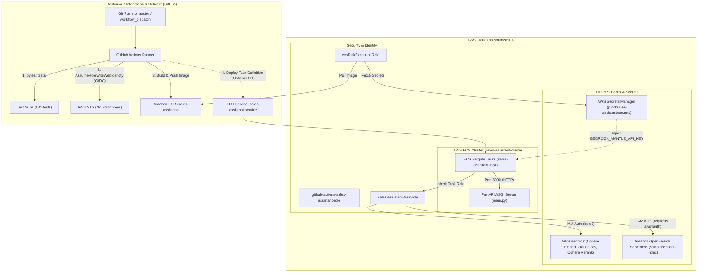

# Production Containerization, CI/CD Pipeline & AWS ECS Fargate Deployment Specification

**Spec ID**: `SPEC-0005`  
**Status**: `Approved`  
**Author**: Assistant & User  
**Date**: 2026-09-21  
**Target Environment**: AWS (Region: `ap-southeast-1`, Account ID: `686511310418`)

---

## 1. Problem Statement & Motivation

### 1.1 Context
The **Sales Assistant** is a unified FastAPI application providing RAG retrieval, ingestion indexing, and LLM response generation backed by Amazon OpenSearch Serverless (AOSS) and AWS Bedrock (runtime Converse API / Bedrock Mantle gateway). To transition from local development to production, the service requires a secure, automated, and reproducible deployment pipeline.

### 1.2 User Story
As a DevOps engineer and developer, I want:
1. Automated testing, containerization, and image publishing whenever code is pushed to `main`/`master` or triggered manually.
2. Production deployment to serverless AWS ECS Fargate with zero-downtime rolling updates.
3. Zero static, long-lived AWS credentials stored in GitHub (IAM OIDC authentication).
4. Strict separation between sensitive secrets (AWS Secrets Manager), runtime IAM credentials (ECS Task Role), and non-sensitive configuration parameters.

### 1.3 Non-Goals / Out of Scope
- Multi-region active-active deployment (Region pinned to `ap-southeast-1` with Bedrock reranking in `ap-northeast-1`).
- Custom domain DNS provisioning (Route53) and TLS termination (handled via ALB / CloudFront in future phases).
- VPC infrastructure provisioning (uses existing default or production VPC).

---

## 2. Technical Architecture & Security Model

### 2.1 Deployment & Runtime Architecture

### 2.2 Security & IAM Role Contracts

Three distinct IAM roles enforce the Principle of Least Privilege:

| Role Name | Trusted Entity | Associated Policies | Purpose |
| :--- | :--- | :--- | :--- |
| **`github-actions-sales-assistant-role`** | `token.actions.githubusercontent.com` (Audience: `sts.amazonaws.com`, Subject: `repo:logacc99/sales-assistant:*`) | `AmazonEC2ContainerRegistryPowerUser`, ECS deployment inline policy | Allows GitHub Actions to authenticate via OIDC, push Docker images to ECR, and update ECS. |
| **`ecsTaskExecutionRole`** | `ecs-tasks.amazonaws.com` | `AmazonECSTaskExecutionRolePolicy`, inline `secretsmanager:GetSecretValue` on `arn:aws:secretsmanager:ap-southeast-1:686511310418:secret:prod/sales-assistant/*` | Allows the ECS Agent to pull private images from ECR, stream logs to CloudWatch, and inject secrets at container launch. |
| **`sales-assistant-task-role`** | `ecs-tasks.amazonaws.com` | `bedrock:InvokeModel*`, `aoss:APIAccessAll` | Injected into the running container; provides `boto3` and `requests-aws4auth` with temporary rotating credentials. |

---

## 3. Configuration & Environment Variables

| Tier | Purpose | Storage / Source | Examples |
| :--- | :--- | :--- | :--- |
| **IAM Credentials** | AWS Service Auth | Injected by `sales-assistant-task-role` | `AWS_ACCESS_KEY_ID`, `AWS_SECRET_ACCESS_KEY` *(omitted in prod)* |
| **Secrets** | Sensitive API Keys | **AWS Secrets Manager** (`prod/sales-assistant/secrets`) | Ex: `BEDROCK_MANTLE_API_KEY`,... |
| **Environment** | App runtime config | **ECS Task Definition** (`environment`) | Ex: `LLM_METHOD`, `OPENSEARCH_HOST`, `APP_PORT=8000`, `APP_RELOAD=false`,... |

---

## 4. Container Specification (`Dockerfile` & `.dockerignore`)

### 4.1 Base Image & Hardening
- **Base Image**: `python:3.11-slim`
- **User Execution**: Non-root user `appuser` (UID: 1000).
- **Working Directory**: `/app`
- **Exposed Port**: `8000`
- **Entrypoint**: `python main.py --host 0.0.0.0 --port 8000 --no-reload`

### 4.2 Build Context Exclusions (`.dockerignore`)
- Must exclude `.git`, local virtual environments, `.env`, `.env.*`, `tests/`, `data/`, `specs/`, and `.pytest_cache`.

---

## 5. CI/CD Pipeline Contract (`.github/workflows/deploy.yml`)

### 5.1 Triggers
- `push` to branches: `master`, `main`
- `workflow_dispatch` (manual on-demand trigger via GitHub Console)

### 5.2 Jobs & Pipeline Gates
1. **`test` Job**:
   - Sets up Python 3.11 with pip caching.
   - Installs `requirements.txt` + `pytest`.
   - Runs `pytest tests/ -k "not test_live"` (must pass 100% of contract tests before image build starts).
2. **`build-and-push` Job**:
   - Depends on `test` passing.
   - Uses `aws-actions/configure-aws-credentials@v4` with `role-to-assume: ${{ secrets.AWS_ROLE_ARN }}`.
   - Logs into Amazon ECR (`686511310418.dkr.ecr.ap-southeast-1.amazonaws.com`).
   - Builds container image and pushes two tags:
     - `latest`
     - `${{ github.sha }}` (immutable git commit hash).
3. **`deploy` Step (Commented / Ready)**:
   - Renders updated Task Definition JSON with new image SHA.
   - Issues rolling service update to `sales-assistant-service` with `wait-for-service-stability: true`.

---

## 6. Edge Cases, Failure Modes & Circuit Breakers

| Failure Mode | Root Cause | Mitigation / Recovery Procedure |
| :--- | :--- | :--- |
| **ECS Deployment Circuit Breaker Triggered** | Tasks crash repeatedly upon launch (exit code != 0). | Inspect stopped tasks under `sales-assistant-cluster` -> `sales-assistant-service` -> `Tasks` (filter: "Stopped"). Check `Stopped reason` and CloudWatch task logs. |
| **`CannotPullContainerError: ...: not found`** | Image with tag `latest` does not exist in ECR yet. | Verify GitHub Actions run status. If GitHub runner is blocked, build and push locally using `docker push 686511310418.dkr.ecr.ap-southeast-1.amazonaws.com/sales-assistant:latest`. |
| **`ResourceInitializationError: ecr:GetAuthorizationToken AccessDenied`** | `ecsTaskExecutionRole` missing ECR pull permissions. | Attach AWS managed policy `AmazonECSTaskExecutionRolePolicy` to `ecsTaskExecutionRole`. |
| **`ResourceInitializationError: unable to retrieve secret`** | Secret ARN mismatch or missing `secretsmanager:GetSecretValue`. | Verify secret name and attach inline policy allowing `secretsmanager:GetSecretValue` on secret ARN to `ecsTaskExecutionRole`. |
| **GitHub Actions Billing Lock** | Account has unpaid balance or payment verification hold on private repo. | Update payment info under GitHub Account Settings -> Billing, or push container directly via AWS CLI. |

---

## 7. Acceptance Criteria

- [x] **Criterion 1 (Containerization)**: `Dockerfile` and `.dockerignore` exist in workspace; image builds cleanly with non-root user and binds to `0.0.0.0:8000`.
- [x] **Criterion 2 (CI/CD Definition)**: `.github/workflows/deploy.yml` configured with OIDC authentication, test gate, ECR push, and `workflow_dispatch`.
- [x] **Criterion 3 (Deterministic Tests)**: All 134 unit and contract tests pass deterministically (`pytest tests/ -k "not test_live"`).
- [x] **Criterion 4 (IAM Security Structure)**: GitHub OIDC Identity Provider and the 3 required IAM roles (`github-actions-sales-assistant-role`, `ecsTaskExecutionRole`, `sales-assistant-task-role`) created and verified.
- [x] **Criterion 5 (Secret Separation)**: Zero hardcoded AWS access keys in git or Docker image; Bedrock Mantle secret mapped to AWS Secrets Manager.
