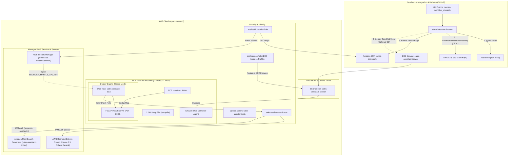

# Production Containerization, CI/CD Pipeline & AWS ECS EC2 Deployment Specification

**Spec ID**: `SPEC-0005`  
**Status**: `Approved`  
**Author**: Assistant & User  
**Date**: 2026-09-22  
**Target Environment**: AWS (Region: `ap-southeast-1`, Account ID: `<AWS_ACCOUNT_ID>`)  
**Deployment Model**: AWS ECS on EC2 (AWS 12-Month Free Tier Optimized)

---

## 1. Problem Statement & Motivation

### 1.1 Context & Free Tier Cost Optimization
The **Sales Assistant** is a unified FastAPI application providing RAG retrieval, ingestion indexing, and LLM response generation backed by Amazon OpenSearch Serverless (AOSS) and AWS Bedrock (runtime Converse API / Bedrock Mantle gateway). 

While **AWS ECS Fargate** offers serverless container management, it does not provide an ongoing free tier and incurs continuous vCPU/RAM charges (~$10–$15/month) plus Application Load Balancer costs (~$16+/month).

To achieve **$0.00/month compute cost** under the **AWS 12-Month Free Tier**, this specification defines an **ECS EC2 Launch Type** architecture utilizing:
1. **EC2 Free Tier Instance**: `t3.micro` or `t2.micro` (750 hours/month free).
2. **Bridge Network Port Mapping**: Direct host port mapping (Host `8000` -> Container `8000`), entirely eliminating the need for an Application Load Balancer ($16/month savings).
3. **EBS Free Tier**: 30 GB gp2/gp3 root storage.
4. **Swap Memory Provisioning**: A 2 GB swap file configured via EC2 User Data to safeguard the 1 GiB micro instance against memory spikes from Python, PyTorch (CPU), and FastAPI.

### 1.2 User Story
As a DevOps engineer and developer, I want:
1. Automated testing, containerization, and image publishing whenever code is pushed to `main`/`master` or triggered manually.
2. Production deployment to an ECS cluster backed by an EC2 Free Tier instance.
3. Zero static, long-lived AWS credentials stored in GitHub (IAM OIDC authentication).
4. Direct external accessibility without expensive load balancers or public NAT gateways.
5. Strict separation between sensitive secrets (AWS Secrets Manager), runtime IAM credentials (ECS Task Role), and non-sensitive configuration parameters.

### 1.3 Non-Goals / Out of Scope
- Multi-AZ or multi-node EC2 cluster (Single `t3.micro`/`t2.micro` instance is used to stay within the 750 free tier hours).
- Application Load Balancer / Route53 domain provisioning (traffic routes directly to the EC2 Public IP / Elastic IP on port 8000).
- GPU acceleration (PyTorch runs with CPU-only wheels inside Docker).

---

## 2. Technical Architecture & Security Model

### 2.1 Deployment & Runtime Architecture



### 2.2 Security & IAM Role Contracts

Four distinct IAM roles enforce the Principle of Least Privilege:

| Role Name | Trusted Entity | Associated Policies | Purpose |
| :--- | :--- | :--- | :--- |
| **`github-actions-sales-assistant-role`** | `token.actions.githubusercontent.com` (Audience: `sts.amazonaws.com`, Subject: `repo:logacc99/sales-assistant:*`) | `AmazonEC2ContainerRegistryPowerUser`, ECS deployment inline policy | Allows GitHub Actions to authenticate via OIDC, push Docker images to ECR, and register task definitions. |
| **`ecsInstanceRole`** | `ec2.amazonaws.com` | `AmazonEC2ContainerServiceforEC2Role`, `AmazonSSMManagedInstanceCore` | Injected into the EC2 host instance via Instance Profile. Allows the ECS Agent to join `sales-assistant-cluster` and enables AWS Systems Manager Session Manager access without SSH keys. |
| **`ecsTaskExecutionRole`** | `ecs-tasks.amazonaws.com` | `AmazonECSTaskExecutionRolePolicy`, inline `secretsmanager:GetSecretValue` on `arn:aws:secretsmanager:ap-southeast-1:<AWS_ACCOUNT_ID>:secret:prod/sales-assistant/*` | Allows the ECS Agent to pull private images from ECR, create CloudWatch log streams, and inject secrets at container launch. |
| **`sales-assistant-task-role`** *(Optional on EC2)* | `ecs-tasks.amazonaws.com` | `bedrock:InvokeModel*`, `aoss:APIAccessAll` | Injected into the running container; provides `boto3` and `requests-aws4auth` with temporary rotating credentials. **Note**: On self-managed EC2/Ubuntu instances, omitting `taskRoleArn` allows containers to inherit `ecsInstanceRole` directly, avoiding `task-iam-role` agent capability requirements. |

> [!NOTE]
> **EC2 IAM Role Inheritance vs Task Role**:
> On AWS Fargate, a `taskRoleArn` is mandatory for container permissions. However, on **AWS EC2**, containers automatically inherit IAM permissions from the host's EC2 Instance Profile (`ecsInstanceRole`) via the instance metadata service (`169.254.169.254`). Specifying a `taskRoleArn` on a self-managed Linux/Ubuntu EC2 instance requires extra iptables credential proxy routing and the `com.amazonaws.ecs.capability.task-iam-role` agent capability. Leaving `taskRoleArn` blank and attaching Bedrock/AOSS policies directly to `ecsInstanceRole` is the recommended, zero-overhead approach for Free Tier single-instance deployments.

---

## 3. ECS Task Definition Specification (EC2 Launch Type)

### 3.1 Task Definition Parameters

```json
{
  "family": "sales-assistant-task-ec2",
  "requiresCompatibilities": ["EC2"],
  "networkMode": "bridge",
  "executionRoleArn": "arn:aws:iam::<AWS_ACCOUNT_ID>:role/ecsTaskExecutionRole",
  "containerDefinitions": [
    {
      "name": "sales-assistant",
      "image": "<AWS_ACCOUNT_ID>.dkr.ecr.ap-southeast-1.amazonaws.com/sales-assistant:latest",
      "essential": true,
      "memoryReservation": 256,
      "portMappings": [
        {
          "containerPort": 8000,
          "hostPort": 8000,
          "protocol": "tcp"
        }
      ],
      "environment": [
        { "name": "AWS_REGION", "value": "ap-southeast-1" },
        { "name": "LLM_METHOD", "value": "runtime" },
        { "name": "OPENSEARCH_HOST", "value": "https://dummy.aoss.amazonaws.com" },
        { "name": "APP_PORT", "value": "8000" },
        { "name": "APP_RELOAD", "value": "false" }
      ],
      "secrets": [
        {
          "name": "BEDROCK_MANTLE_API_KEY",
          "valueFrom": "arn:aws:secretsmanager:ap-southeast-1:<AWS_ACCOUNT_ID>:secret:prod/sales-assistant/secrets:BEDROCK_MANTLE_API_KEY::"
        }
      ],
      "logConfiguration": {
        "logDriver": "awslogs",
        "options": {
          "awslogs-group": "/ecs/sales-assistant-task",
          "awslogs-region": "ap-southeast-1",
          "awslogs-stream-prefix": "ecs",
          "awslogs-create-group": "true"
        }
      }
    }
  ]
}
```

### 3.2 Configuration & Environment Variables

| Tier | Purpose | Storage / Source | Examples |
| :--- | :--- | :--- | :--- |
| **IAM Credentials** | AWS Service Auth | Injected by `sales-assistant-task-role` | `AWS_ACCESS_KEY_ID`, `AWS_SECRET_ACCESS_KEY` *(omitted in prod)* |
| **Secrets** | Sensitive API Keys | **AWS Secrets Manager** (`prod/sales-assistant/secrets`) | `BEDROCK_MANTLE_API_KEY` |
| **Environment** | App runtime config | **ECS Task Definition** (`environment`) | `LLM_METHOD`, `OPENSEARCH_HOST`, `APP_PORT=8000`, `APP_RELOAD=false` |

---

## 4. Container Specification (`Dockerfile` & `.dockerignore`)

### 4.1 Base Image & Hardening
- **Base Image**: `python:3.11-slim`
- **PyTorch Wheel**: Installed via `--extra-index-url https://download.pytorch.org/whl/cpu` to avoid 5.3 GB of CUDA bloat on the 1GB RAM EC2 instance.
- **User Execution**: Non-root user `appuser` (UID: 1000).
- **Working Directory**: `/app`
- **Exposed Port**: `8000`
- **Entrypoint**: `python main.py --host 0.0.0.0 --port 8000 --no-reload`

### 4.2 Build Context Exclusions (`.dockerignore`)
- Must exclude `.git`, local virtual environments, `.env`, `.env.*`, `tests/`, `data/`, `specs/`, and `.pytest_cache`.

### 4.3 Manual Docker Build, Test & ECR Push Runbook (Self-Debugging)

Use these commands to build, run locally for troubleshooting, and push directly to Amazon ECR without waiting for CI/CD:

```bash
# 1. (One-time) Create ECR repository if not already created
aws ecr create-repository \
  --repository-name sales-assistant \
  --region ap-southeast-1

# 2. Authenticate Docker CLI to Amazon ECR
aws ecr get-login-password --region ap-southeast-1 | \
  docker login --username AWS --password-stdin <AWS_ACCOUNT_ID>.dkr.ecr.ap-southeast-1.amazonaws.com

# 3. Build Docker image locally
docker build -t sales-assistant:latest .

# 4. (Optional) Run and debug container locally
docker run --rm -d \
  --name sales-assistant-local \
  -p 8000:8000 \
  --env-file .env \
  sales-assistant:latest

# Check local container health & logs
curl http://localhost:8000/health
docker logs -f sales-assistant-local

# Stop local container
docker stop sales-assistant-local

# 5. Tag image for Amazon ECR (both latest and short git commit SHA)
docker tag sales-assistant:latest <AWS_ACCOUNT_ID>.dkr.ecr.ap-southeast-1.amazonaws.com/sales-assistant:latest
docker tag sales-assistant:latest <AWS_ACCOUNT_ID>.dkr.ecr.ap-southeast-1.amazonaws.com/sales-assistant:$(git rev-parse --short HEAD)

# 6. Push images to Amazon ECR
docker push <AWS_ACCOUNT_ID>.dkr.ecr.ap-southeast-1.amazonaws.com/sales-assistant:latest
docker push <AWS_ACCOUNT_ID>.dkr.ecr.ap-southeast-1.amazonaws.com/sales-assistant:$(git rev-parse --short HEAD)
```

---

## 5. Step-by-Step EC2 Setup & Deployment Guide

Follow these steps to configure your AWS account for the Free Tier EC2 deployment:

### Step 1: Create the EC2 Instance IAM Role (`ecsInstanceRole`)
1. Open **IAM Console** -> **Roles** -> **Create Role**.
2. Select **AWS Service** -> Use Case: **EC2**.
3. Attach policies:
   - `AmazonEC2ContainerServiceforEC2Role` (Allows instance to register with ECS).
   - `AmazonSSMManagedInstanceCore` (Allows AWS Systems Manager Session Manager access without SSH keys).
   - `AmazonBedrockFullAccess` (or inline `bedrock:InvokeModel*` for LLM inference & embeddings when `taskRoleArn` is omitted).
   - `AmazonOpenSearchServerlessFullAccess` (or inline `aoss:APIAccessAll` for vector indexing & retrieval).
4. Name the role: **`ecsInstanceRole`** and complete creation.

### Step 2: Create a Security Group (`sales-assistant-ec2-sg`)
1. Open **EC2 Console** -> **Network & Security** -> **Security Groups** -> **Create Security Group**.
2. **Name**: `sales-assistant-ec2-sg` (VPC: Default VPC).
3. **Inbound Rules**:
   - **Type**: Custom TCP | **Port**: `8000` | **Source**: `0.0.0.0/0` (Anywhere IPv4, or your specific IP).
4. **Outbound Rules**: All traffic allowed (Default).

### Step 3: Launch the Free Tier EC2 Worker Instance
1. Open **EC2 Console** -> **Launch Instances**.
2. **Name**: `sales-assistant-ecs-worker`.
3. **AMI**: Select **Ubuntu Server 24.04 LTS (HVM), SSD Volume Type** (marked **Free tier eligible** in Quick Start).
4. **Instance Type**: Select **`t3.micro`** (or `t2.micro` if in a legacy region) marked **Free tier eligible**.
5. **Key Pair**: Proceed without key pair (access is handled via AWS SSM Session Manager).
6. **Network Settings**:
   - VPC: Default VPC.
   - Auto-assign Public IP: **Enable**.
   - Security Group: Select `sales-assistant-ec2-sg`.
7. **Storage**: **30 GiB gp3** (within 30 GB EBS Free Tier limit).
8. **Advanced Details**:
   - **IAM instance profile**: Select **`ecsInstanceRole`**.
   - **User data** (paste the following script verbatim):
     ```bash
     #!/bin/bash
     # 1. Provision 2GB swap space to safeguard 1GB RAM against OOM
     fallocate -l 2G /swapfile
     chmod 600 /swapfile
     mkswap /swapfile
     swapon /swapfile
     echo "/swapfile none swap defaults 0 0" >> /etc/fstab

     # 2. Install Docker & prerequisites
     apt-get update -y
     apt-get install -y docker.io curl
     systemctl enable --now docker

     # 3. Create ECS directory and configure target cluster
     mkdir -p /etc/ecs /var/log/ecs /var/lib/ecs/data
     echo "ECS_CLUSTER=sales-assistant-cluster" > /etc/ecs/ecs.config

     # 4. Run the Amazon ECS Container Agent
     docker run --name ecs-agent \
       --detach=true \
       --restart=always \
       --volume=/var/run:/var/run \
       --volume=/var/log/ecs/:/var/log/ecs/ \
       --volume=/var/lib/ecs/data:/var/lib/ecs/data \
       --volume=/etc/ecs:/etc/ecs \
       --net=host \
       --env-file=/etc/ecs/ecs.config \
       amazon/amazon-ecs-agent:latest
     ```
9. Click **Launch Instance**.

### Step 4: Verify ECS Cluster & Container Instance Registration
1. Open **Amazon ECS Console** -> **Clusters**.
2. If `sales-assistant-cluster` does not exist, click **Create Cluster**:
   - Cluster name: `sales-assistant-cluster`.
   - Infrastructure: Check **Amazon EC2 instances**.
3. Within 1–2 minutes after the EC2 instance launches, open `sales-assistant-cluster` -> **Infrastructure** tab.
4. Verify that **Container Instances** displays **1 Registered / Active**.

### Step 5: Register the Task Definition
Register `sales-assistant-task-ec2` via AWS Console (Task Definitions -> Create new Task Definition with JSON) or AWS CLI:
```bash
aws ecs register-task-definition --cli-input-json file://task-definition-ec2.json
```

### Step 6: Create/Update the ECS Service
1. Open `sales-assistant-cluster` -> **Services** -> **Create** (or **Update Service**).
2. **Launch Type**: Choose **EC2**.
3. **Task Definition**: Family `sales-assistant-task-ec2`, Revision `Latest`.
4. **Service Name**: `sales-assistant-service`.
5. **Desired Tasks**: `1`.
6. **Deployment Configuration** (CRITICAL for single-instance Free Tier with static hostPort):
   - **Deployment Type**: Rolling update
   - **Minimum running tasks in percent**: `0%`
   - **Maximum running tasks in percent**: `100%`
   - **Availability Zone rebalancing**: Uncheck (single instance in single AZ)
   *(This ensures ECS terminates the existing task before starting a new one, releasing host port 8000 and avoiding placement port conflicts).*
7. **Load Balancer**: Select **None** (direct EC2 host access).
8. Click **Create** / **Update**.

---

## 6. Edge Cases, Failure Modes & Circuit Breakers

For detailed edge cases, root causes, exact services having errors, diagnostic logs, and recovery runbooks, refer to: `specs/deployment-failure-cases.md`

---

## 7. Acceptance Criteria

- [x] **Criterion 1 (Containerization)**: `Dockerfile` and `.dockerignore` configured with CPU-only PyTorch, non-root user, and exposed port `8000`.
- [x] **Criterion 2 (Free Tier EC2 Spec Contract)**: Spec defines EC2 launch type (`t3.micro`/`t2.micro`), `bridge` networking, 2 GB swap space, and eliminating the ALB.
- [x] **Criterion 3 (Deterministic Tests)**: All 134 unit and contract tests pass deterministically (`pytest tests/ -k "not test_live"`).
- [x] **Criterion 4 (IAM Security Structure)**: IAM matrix defines all 4 required roles (`github-actions-sales-assistant-role`, `ecsInstanceRole`, `ecsTaskExecutionRole`, `sales-assistant-task-role`).
- [x] **Criterion 5 (Secret Separation)**: Zero hardcoded AWS access keys in git or Docker image; Bedrock Mantle secret mapped to AWS Secrets Manager.
