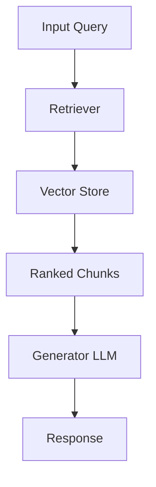

# [Feature / Component Name] Specification

**Spec ID**: `SPEC-XXXX`  
**Status**: `Draft | In Review | Approved | Superseded`  
**Author**: [User / Agent]  
**Date**: YYYY-MM-DD  

---

## 1. Problem Statement & Motivation
- **Context**: Why is this feature or component needed?
- **User Story**: As a [role], I want [capability] so that [benefit].
- **Non-Goals / Out of Scope**: What will this spec explicitly *not* cover?

---

## 2. Technical Architecture & Data Contracts (optional, only required for technical specs)

### 2.1 Data Models / Schemas
Define any schemas (e.g. Document, Chunk, Query, Context, Response).
```python
# Example interface / schema definition
```

### 2.2 Component Interactions


### 2.3 Algorithms & Parameters
- **Chunking Strategy**: e.g. Recursive character, token-based, Markdown-aware.
- **Chunk Size & Overlap**: e.g. 512 tokens, 50 token overlap.
- **Embedding Model**: Model name, dimensionality, distance metric (Cosine, L2).
- **Retrieval Policy**: Top-K, similarity threshold, hybrid dense/sparse.

---

## 3. Interfaces & API Contracts

Specify the public method signatures and return types.
```python
# Example:
# def retrieve(query: str, top_k: int = 5) -> list[RetrievedChunk]:
```

---

## 4. Edge Cases & Error Handling
- Empty query handling
- Out-of-vocabulary or no relevant documents found (similarity < threshold)
- Context length truncation and budget management
- Rate limits or model downtime

---

## 5. Acceptance Criteria & Evaluation Plan

### 5.1 Automated Acceptance Criteria
- [ ] Criterion 1: Unit tests passing for chunking with various document types.
- [ ] Criterion 2: Vector index creation and retrieval test passing.
- [ ] Criterion 3: Deterministic mock responses for generation test passing.

### 5.2 RAG Quality Metrics
- **Retrieval Precision@K / Hit Rate**: Target $\ge 80\%$.
- **Faithfulness / Groundedness**: Response contains no ungrounded hallucinations.
- **Latency Budget**: End-to-end response under target SLA (e.g. $\le 1.5s$).

---

## 6. Open Questions & Trade-offs
- Document unresolved questions to be addressed via `/grill-me`.
